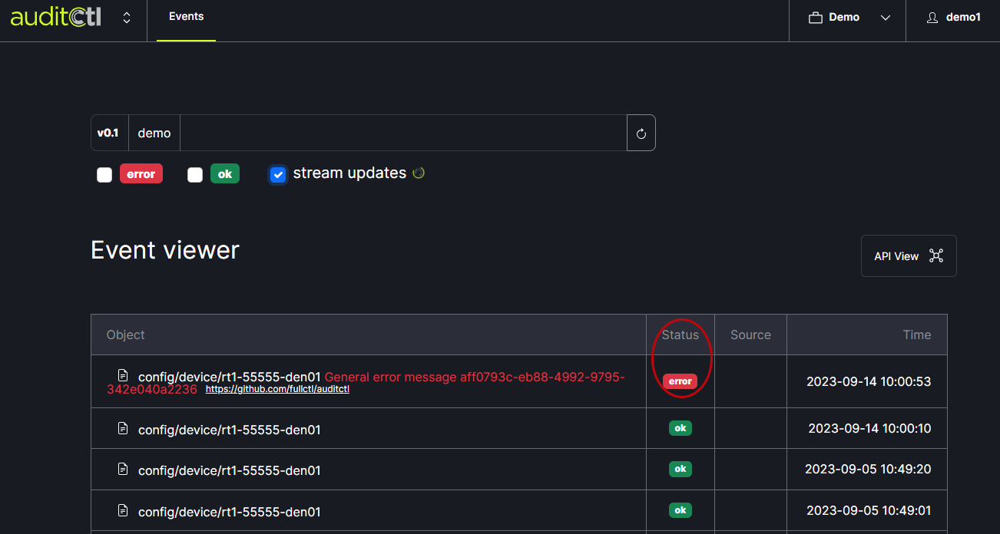
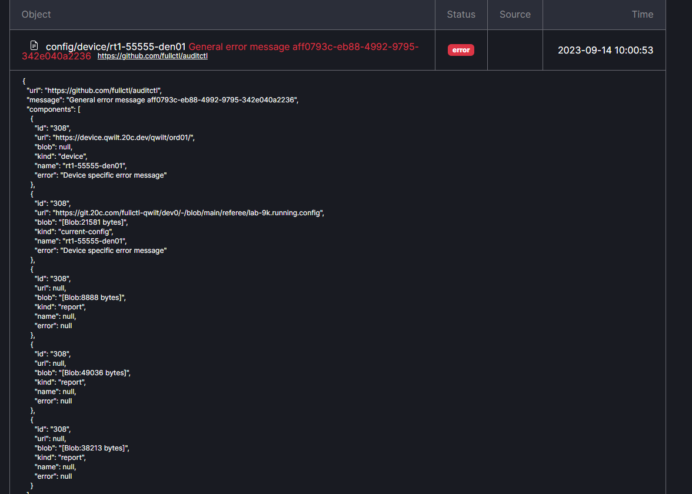

# Add a Route Server

If there are event listings in AuditCtl it means referee pushed a new config. If the event listing shows red in the Status field, it indicates that there was an error. 
   

Clicking on an event listing expands the field to reveal details about the event.  
   
