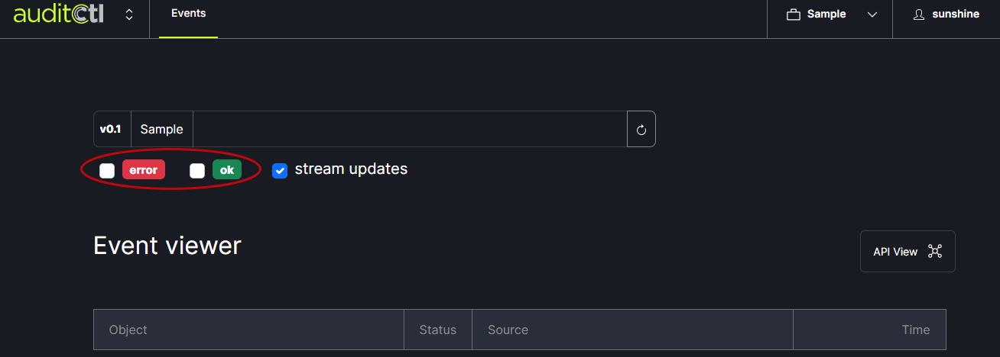
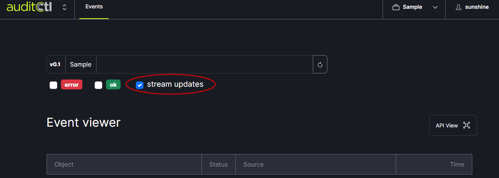
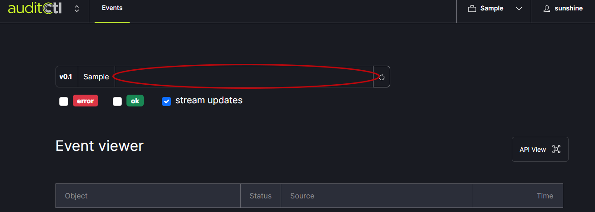
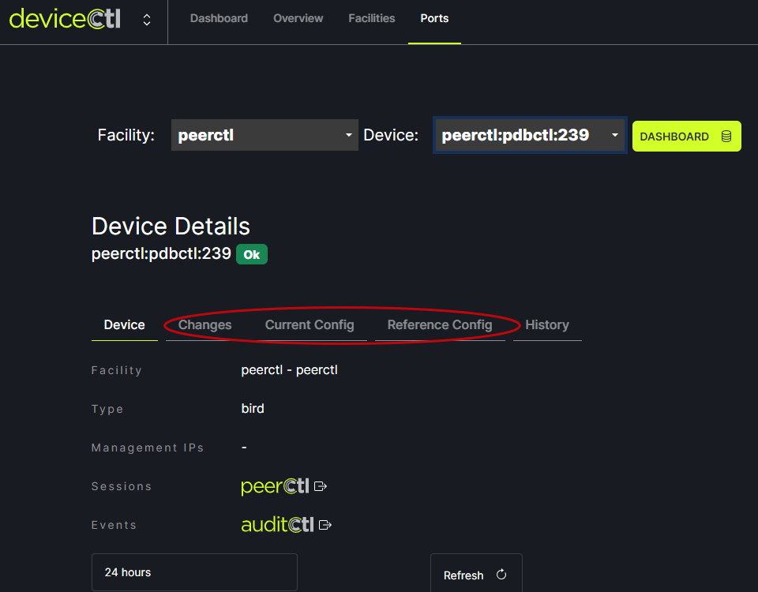

# Overview

AuditCtl records events from other FullCtl services. _Note: Currently it is only logging events related to DeviceCtl._

The error and ok check boxes can be used to filter the list of results shown. 
   
   
The stream updates check box (when checked) indicates that the feed is a live view. Unchecking the box will provide a snapshot in time.
   

The fillable field at the top of the window is a filter (not a search field). It filters based on event object path matching. If you click on the page icon next to an event listing it will auto fill the filter field. 
   

AuditCtl pushes information to DeviceCtl. Specifically, on the Ports tab in the Changes, Current Config and Reference Config sections.
   
