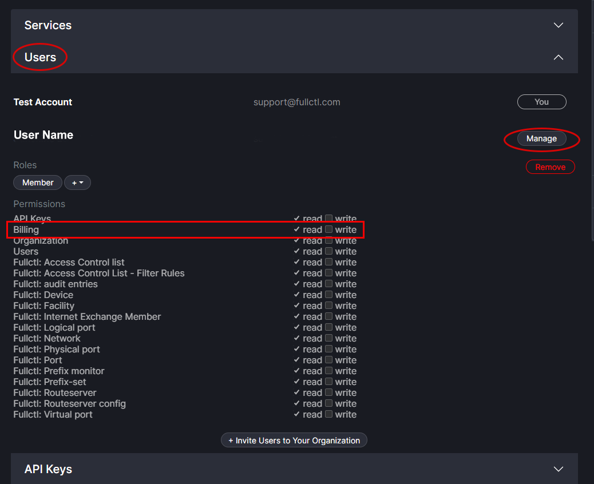

# Billing Overview

FullCtl billing is processed through [Stripe](https://stripe.com/), a secure online platform. When you enter financial information into FullCtl it goes directly to Stripe. FullCtl does not retain any financial information.

To enter billing information into the system, be aware that it must be done by an Organization Administrator or by a User who has been granted read/write access to the billing option by an Organization Administrator. To grant read/write permissions for a User, go to the Users section of aaaCtl. Click on the Manage button next to the User's name. Under Permissions, check the write box for Billing.

An Organization can have multiple billing contact people listed if desired. For example, if a User leaves an Organization a new billing contact person can be added. Each billing contact person can have multiple methods of payment associated if desired. For example, if a credit card becomes outdated a new credit card needs to be added. 

Note: If a second billing contact and payment method is added for your Organization, the system will automatically bill to the most recent financial information added. If you would like a previously entered payment method to be used please contact <a href="mailto: support@fullctl.com" target="_blank">support@fullctl.com</a>

