# Setup Payment by ACH (Bank Transfer)

Click on the Billing tab in the header.
   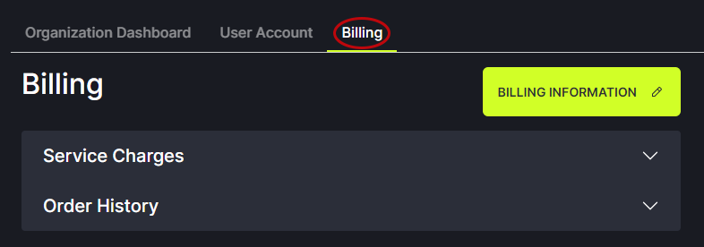

Click on the Billing Information button.
   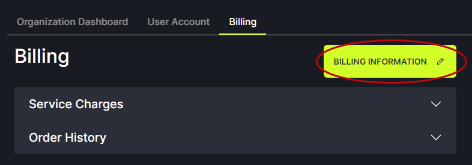

Click the Add button to enter a new billing contact person. 
   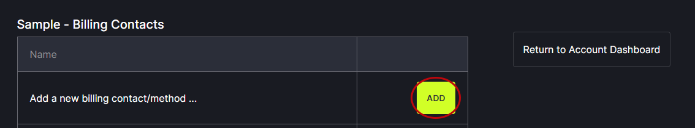

Enter the contact person’s name, email, address and phone number. This adds the contact person to FullCtl.
   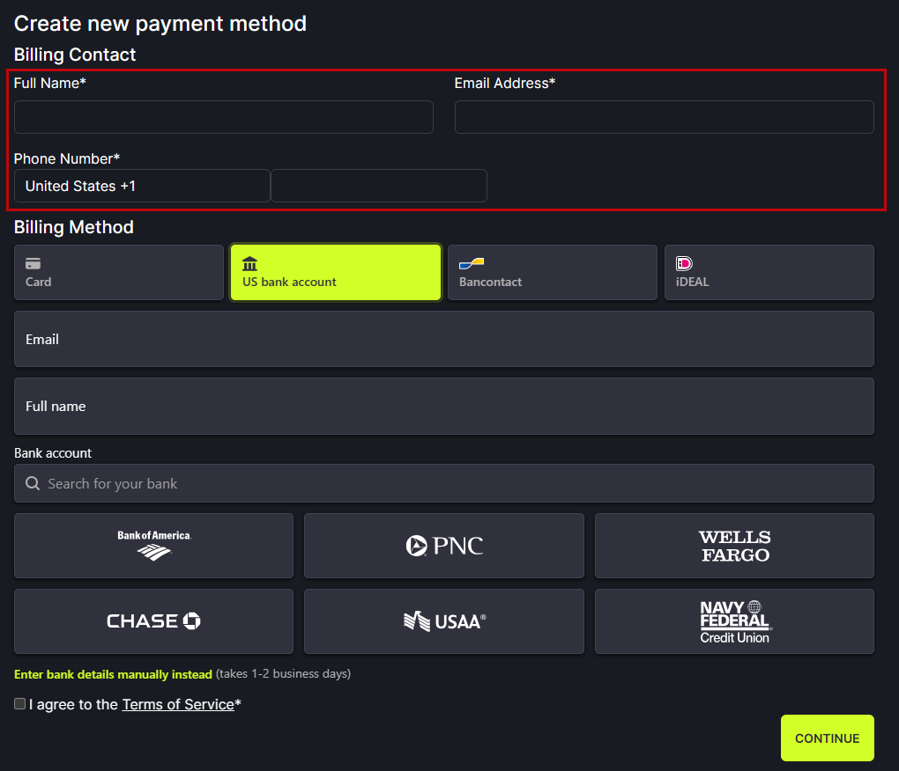

Choose Billing Method - US bank account. 

Enter bank account holder’s email and full name. This saves the contact person in Stripe.
   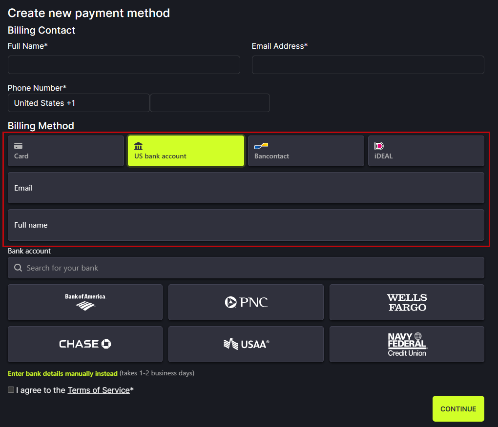

**Option A: Your bank is one of the options listed** 
   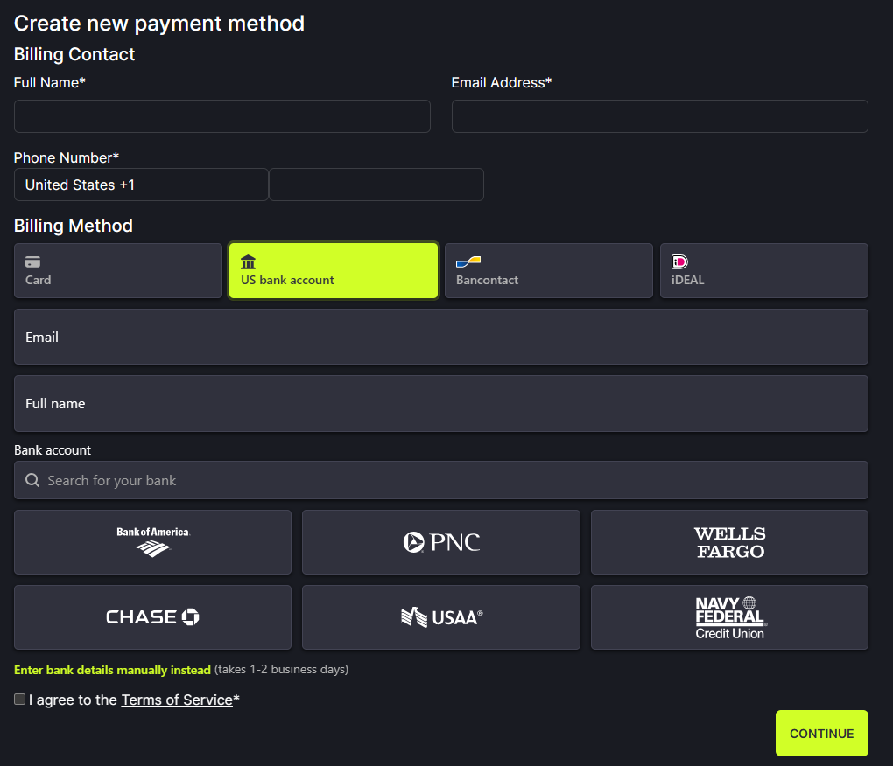

Click on the name of your bank.

In the popup, click Agree and continue.
   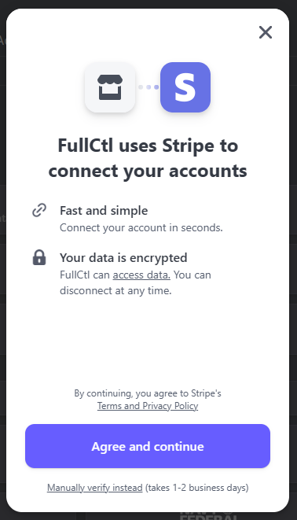

In the next popup, click Continue.
   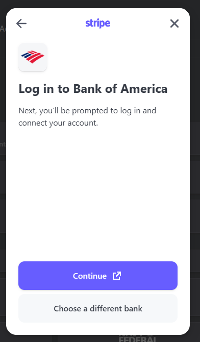

Follow the prompts to log into your bank account and enter the necessary information. 

IMPORTANT: When all steps are complete on the bank website, return to the FullCtl website. You must read the [Terms of Service](https://www.fullctl.com/legal#section=collapseToS), check the box, and click Continue to finalize the setup process.

Entering your billing information does not automatically charge your credit card. Charges are applied when FullCtl Administration turns on your paid service subscription. Once your subscription is turned on you will be charged monthly. 
   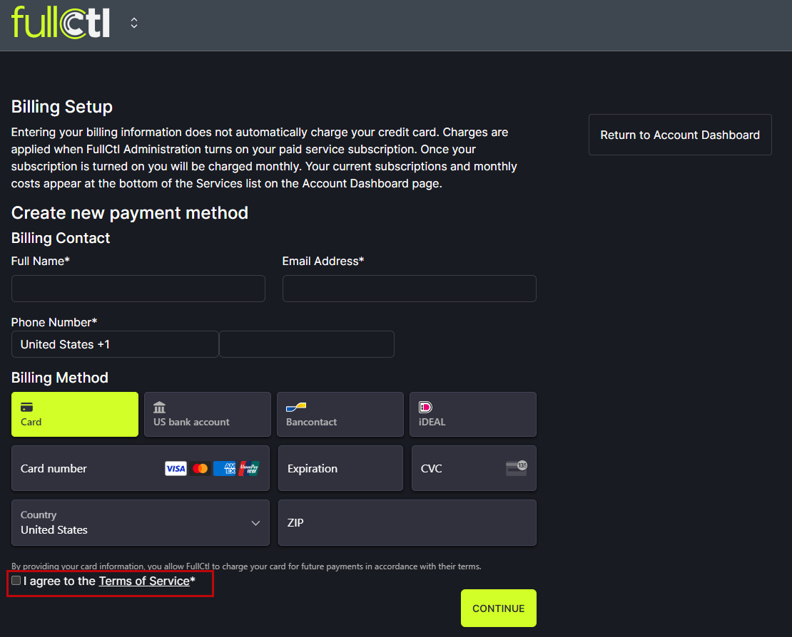

**Option B: Your bank is not one of the options listed** 

If your bank is not among the listed options click on Enter bank details manually instead.
   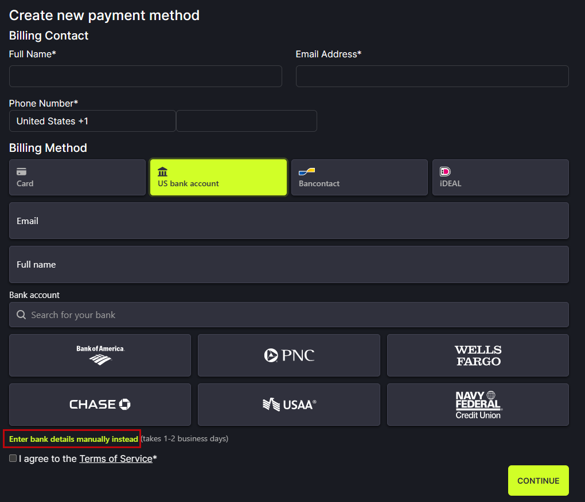

In the popup, click Agree and continue.
   

In the next popup, click Back to FullCtl to complete the process.
   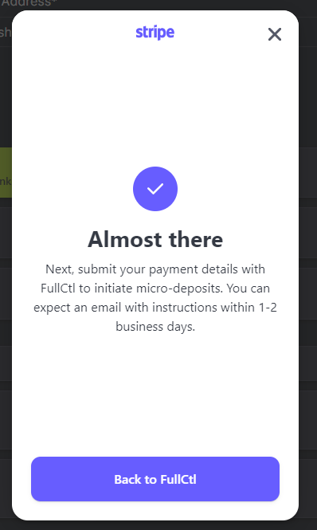

IMPORTANT: When all steps are complete on the bank website, return to the FullCtl website. You must read the [Terms of Service](https://www.fullctl.com/legal#section=collapseToS), check the box, and click Continue to finalize the setup process.

Entering your billing information does not automatically charge your credit card. Charges are applied when FullCtl Administration turns on your paid service subscription. Once your subscription is turned on you will be charged monthly. 
   

You will receive an email from Stripe explaining that you have signed up for direct debits from FullCtl. 
   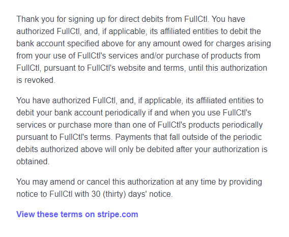

In 1-2 business days, you will receive an email from Stripe asking you to check your bank account for a deposit. Click the link in the email to Verify deposit. 
   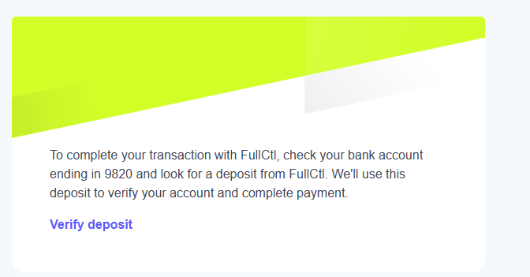

When you click the link, you open a page where you will enter a 6-digit code from your banking records. Log into your bank account so you can view recent deposits. Look for the deposit from Stripe and find the needed code. Enter it into the Verify deposit page from Stripe and click Verify. 
   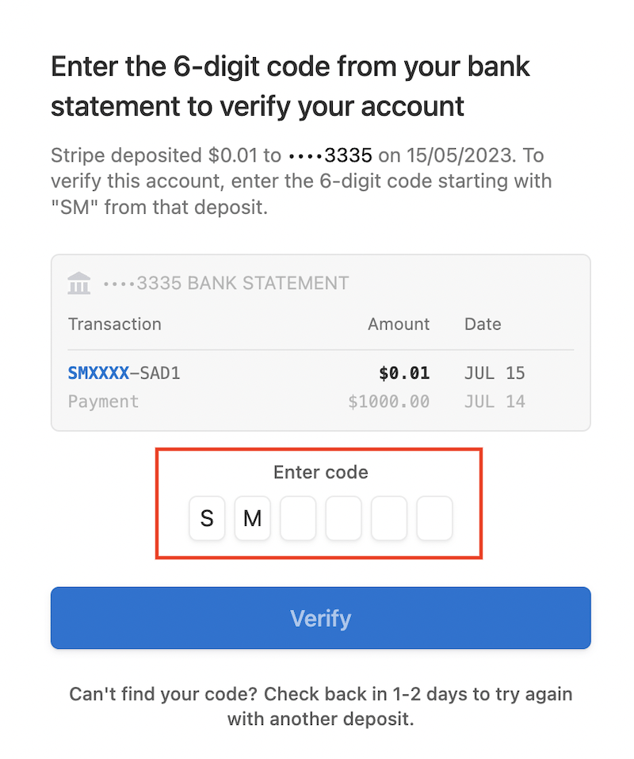

After you enter the code, you get a message telling you the account was verified. At this point, the setup process is complete. 
   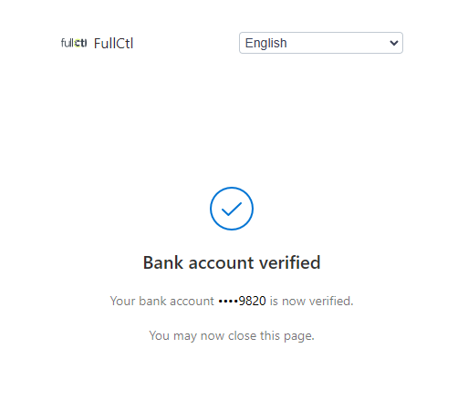

