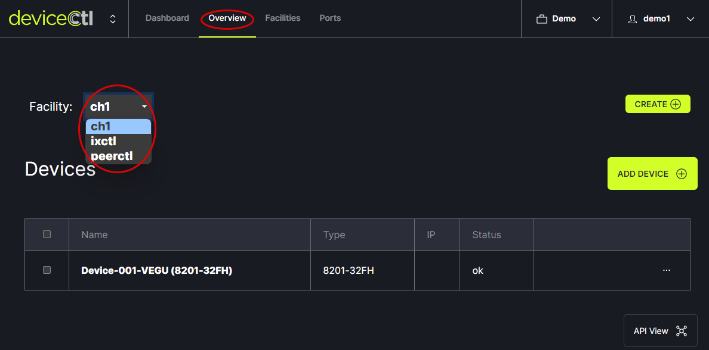
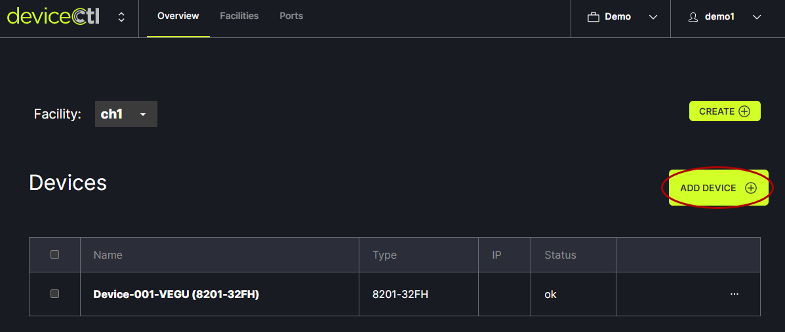
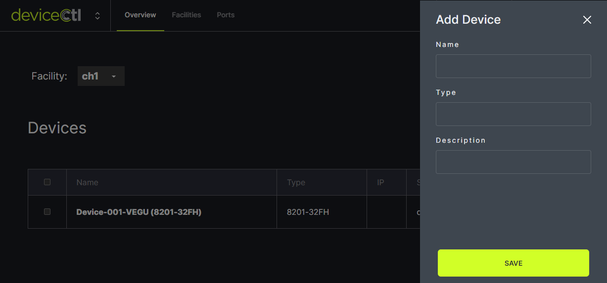

# Add Device

From the Overview tab in the header menu, choose the facility to work with from the drop down menu.
   

Add a Device by clicking the Add Device button on the right side of the window.
   

In the modal, enter the Name, Type, Description and click Save.
   

