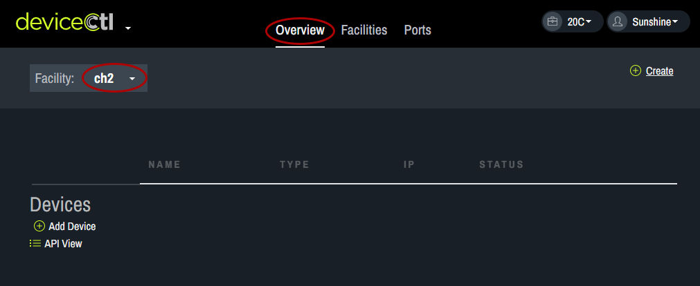
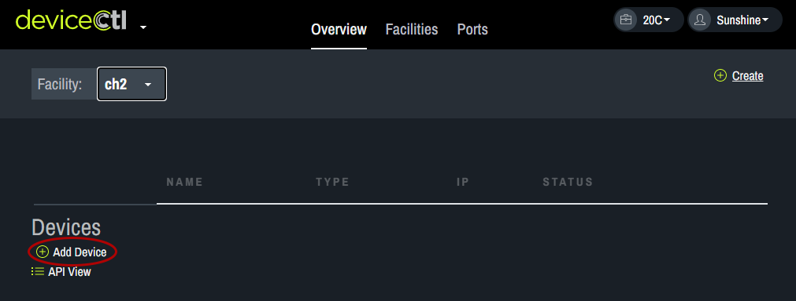

# Add Device

From the Overview tab in DeviceCtl, choose the facility to work with from the drop down menu.
   
Add a Device by clicking the option on the left side of the screen.
   
In the pop up box, enter the Name, Type, Description and click Save.
   

