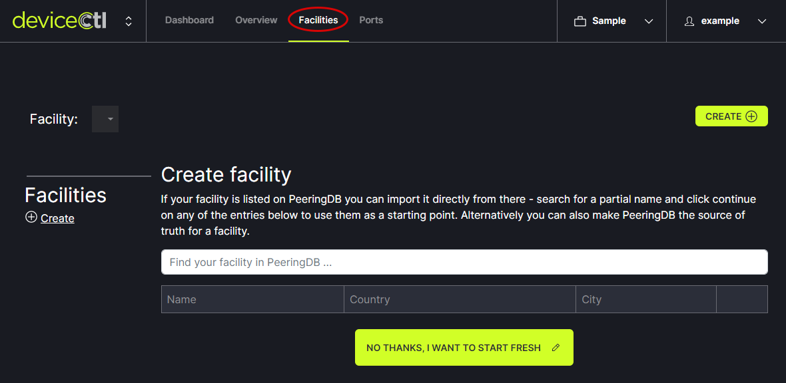
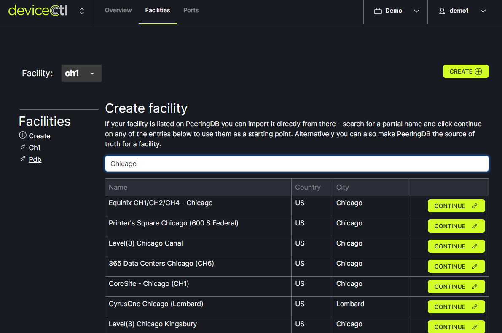
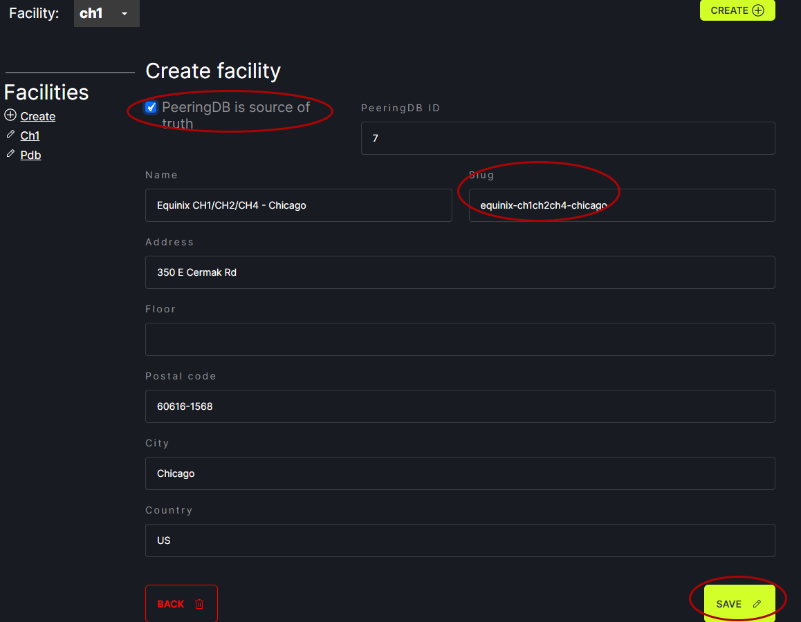

# Add Facility

Sites or Facilities are imported from PeeringDB to get the address, geographic coordinates (longitude and latitude), and other information. To add a facility, click on the Facilities tab in the header menu.
   

If the facility is in PeeringDB, enter the facility name into the box to find the facility in PeeringDB. Click Continue next to the facility of choice.
   

Review the information that appears. Specifically, you'll probably want to change the slug, as that is what is used to reference the facility across all the software. If you wish to keep the information up to date with PeeringDB, check the "PeeringDB is source of truth" box. If you would like to override the data, simply uncheck it. Click Save.
   

