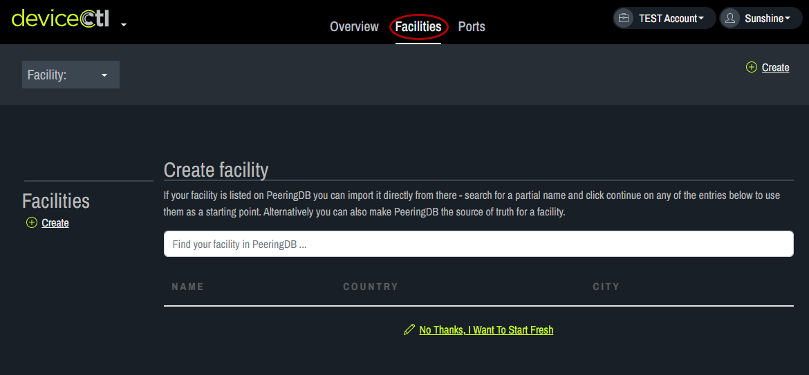
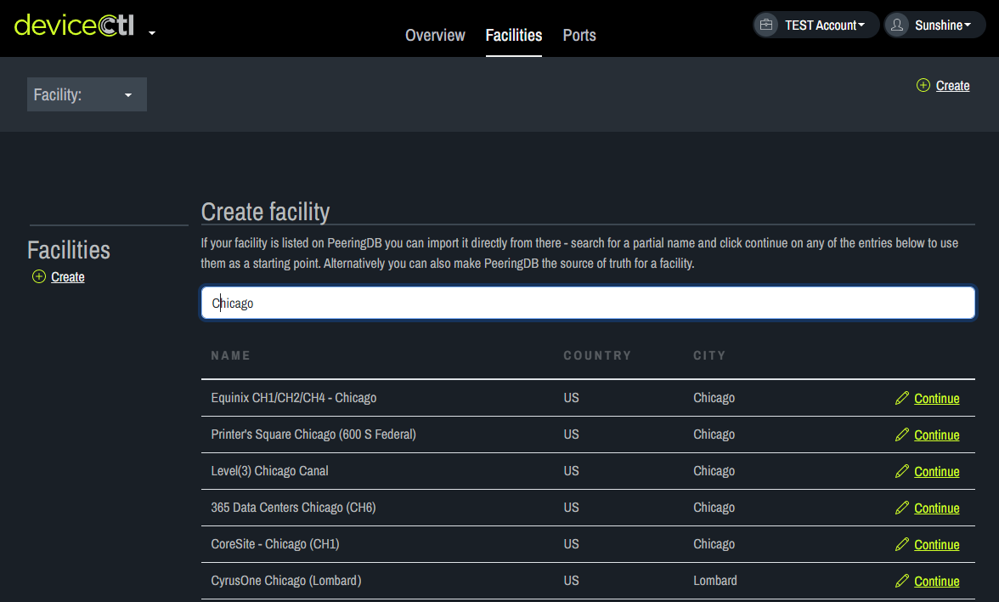
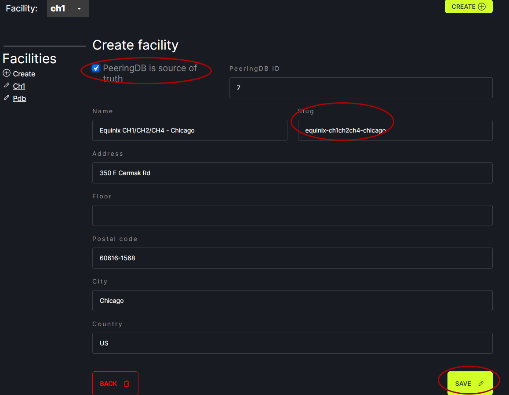

# Add Facility

In DeviceCtl, click on the Facilities tab at the top of the screen. 
   
If the facility is in PeeringDB, enter the information into the box to find the facility in PeeringDB. Click Continue next to the facility of choice.
   
Review the information that appears. Click PeeringDB is source of truth. Click Save.
   

