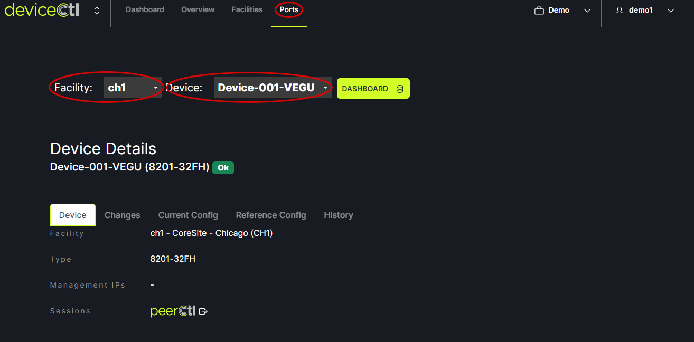
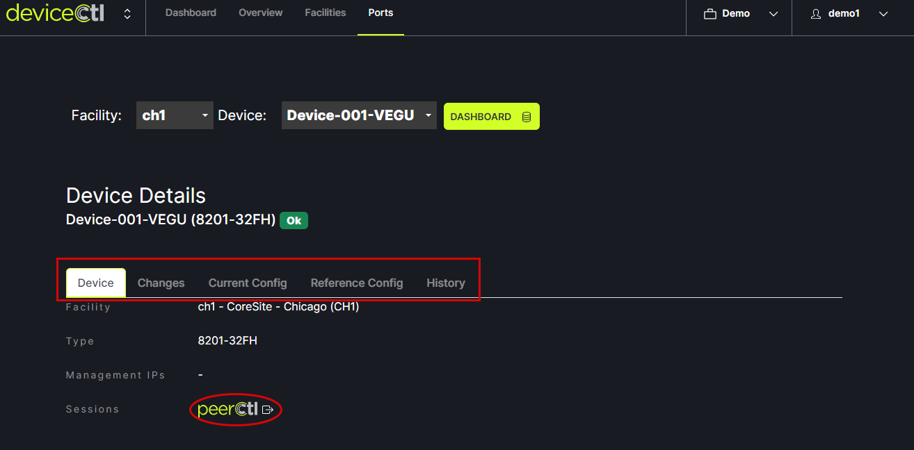
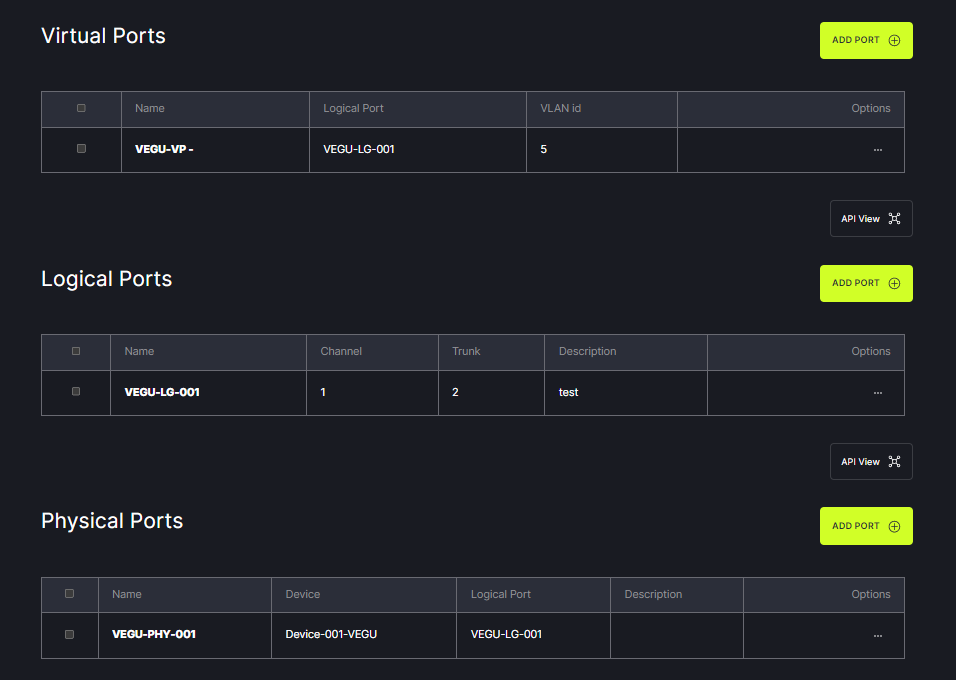
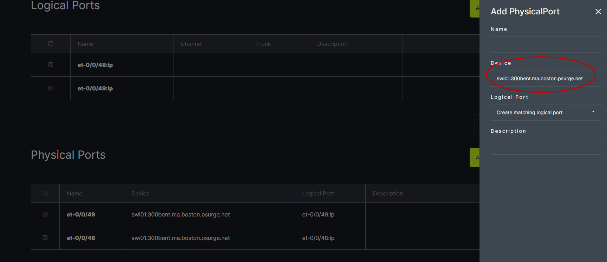

# Ports

Clicking on the Ports tab in the header menu provides a view of the port infrastructure. Choose the Facility and Device to view from the drop down options. 
   
   
Device details can be viewed using the tabs under Device Details. Clicking on peerCtl takes you to the related peer session. 
   
   
 The logical, physical and virtual ports can be managed on this page as well.
    

IMPORTANT NOTE: When adding a Physical Port the exact device name on the physical port must be used.
    
