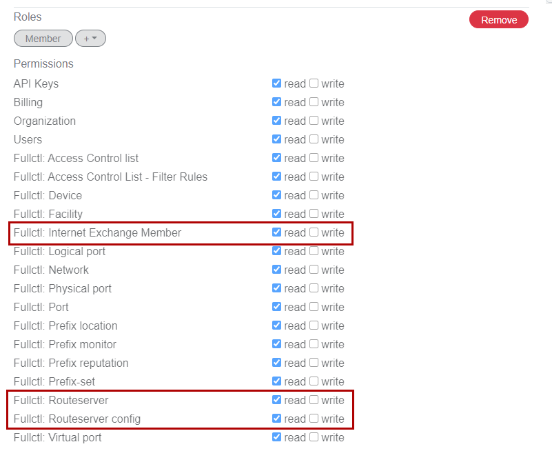
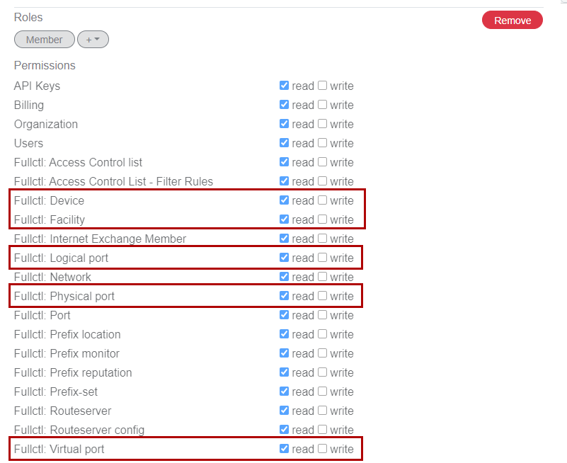
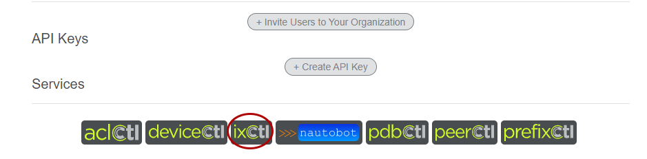

# Setting up Your Organization in FullCtl

If you do not already have users and organizations in FullCtl, the first thing you need to do is sign in and create an organization. While it’s possible to create an IX without an organization, it’s recommended to use organizations to organize things. Organizations also allow easy segmentation of responsibilities if you have more than one or different people responsible for different IXs, etc. Note that you (and other members of your organization) can use our OAuth support to login with an existing google or PeeringDB account. If you have an existing OAuth authentication infrastructure, you can contact 20c for help integrating it with FullCtl.

References
- [Create Your Login](https://docs.fullctl.com/aaaCtl/Sign-up-for-account/)
- [Create an Organization](https://docs.fullctl.com/aaaCtl/Add-Organization/)
- [Adding Users](https://docs.fullctl.com/aaaCtl/Add-Users/)

If you create a user to manage your IX, they will need the following read/write permissions for route server configuration and member management: Internet Exchange Member, Routeserver, Routeserver config.
   
   
If you are incorporate DeviceCtl for infrastructure management and statistics, you will also want: Device, Facility, Logical Port, Physical Port, Virtual Port.
   
   
Once you have your organization and users setup, click on the ixCtl button under services to proceed to create and configure your IX and services.
   

To populate your IX with its members, you can either import the IX and its current PeeringDB member list or create a new IX and enter members from scratch. It is recommended to use the import method for initial setup, unless you’re starting a new IX in which case you can enter your initial members by hand and then export them to PeeringDB via IX-F export.

[Import an IX](https://docs.fullctl.com/ixctl/Import-an-IX/)

[Create a new IX](https://docs.fullctl.com/ixctl/Create-an-IX/)

Either way you create your IX, you can add new members, edit existing member information, or remove members from ixCtl. See [Add a Member](https://docs.fullctl.com/ixctl/Add-a-Member/) to add a new member or use the edit icon (pencil) to edit an existing member. The trashcan icon will allow you to delete a member. Be aware that once you have an existing IX, you can not re-import from peeringDB without deleting the entire IX and reimporting. [Setting up IX-F export](https://docs.fullctl.com/ixctl/Share-the-member-list/) is a great way to keep peeringDB in sync and up to date with your local SoT.

Once you have your IX created and some members listed, you can create one or more route servers to facilitate multilateral peering. Follow these steps to create your route server(s). You will need to assign IP addresses to the route servers at this time.

New route servers are created with basic defaults, to update these to suit your local policies, select Edit for the route server you wish to configure. While ixCtl uses many ARouteServer features, you can use the extra config (yaml) section to add whatever additional configuration you wish. ixCtl updates configurations every 5 minutes, and will indicate when any changes are queued for updates and when the new configuration is ready on the Members tab.Use the Download Configuration button to view the configuration generated by ixCtl and confirm everything is ready to go. You can make updates at any time and they will be incorporated into the configuration during the next update run.

You can now set up systems for running ixCtl containers on, as noted in the Prerequisites section. While you can run these containers in kubernetes systems, such setup is beyond the scope of this document. Likewise, non-RedHat based systems can be used as long as they support docker style containers. This guide will focus on RHEL 8 systems using podman, but these instructions should be broadly adaptable to a range of distributions.
