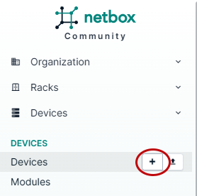
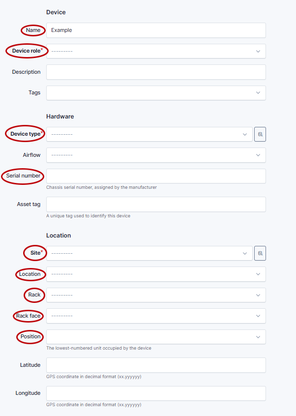
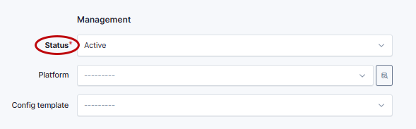
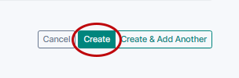

# Add Device

If a device is created in Netbox it will propagate into DeviceCtl. The next time Referee runs it discovers the new device, adds it into the inventory file hosts.yaml and creates a merge request (MR) in ```production``` repository to approve this change. Once the MR is merged, the new device will be processed by Referee.

Click on Devices and the + symbol to add a new device.

   

Fill out the following fields:
Device: Name, Device role
Hardware: Device type, Serial number
Location: Site, Location, Rack, Rack face, Positon

   

In the Management section, set the Status to Active.

   

Click Create to validate the device addition.

   
