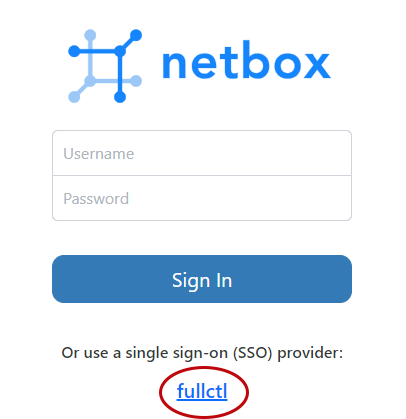

# Account Dashboard

After you have worked with the FullCtl Team to integrate NetBox with your FullCtl account, you will be able to log into NetBox through FullCtl. 

Login to your FullCtl account: [account.fullctl.io](https://account.fullctl.io/account/). [How to create an account](https://docs.fullctl.com/aaaCtl/Sign-up-for-fullctl/)
   

The FullCtl Team will provide you with a NetBox link that is unique to your Organization. From that link, click on the fullctl link at the bottom of the login screen.
   
