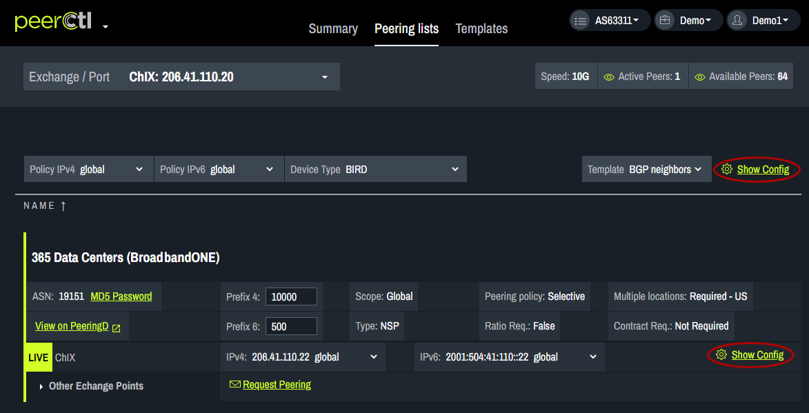
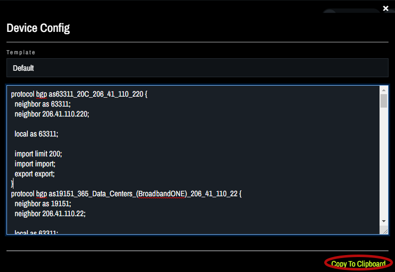
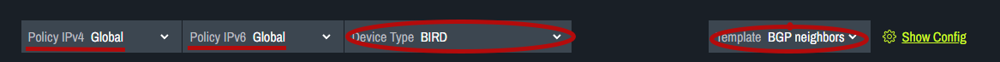
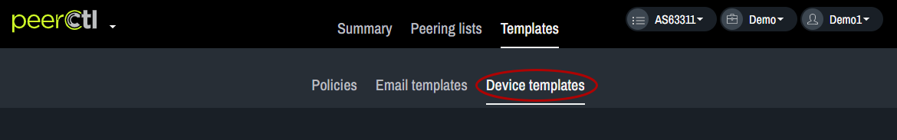
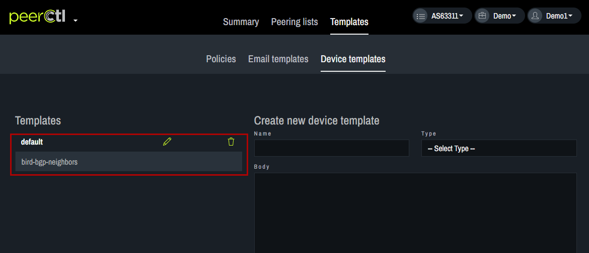
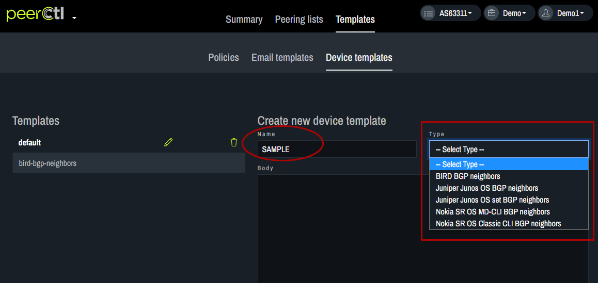

# Device Configuration

To view the current device configuration, click Show Config. The Show Config option at the top of the page provides access to the configuration settings for all the networks on the page. The Show Config option next to each network provides access to the configuration settings only for that particular network. 
   

The configuration specifications for the chosen Template will appear in the pop-up box. It can be copied for pasting into router configurations using the Copy to Clipboard option at the bottom of the box. 
   

The information in the device configuration is based on the chosen Policy and the settings chosen for Device Type and Template. 
   
   

After choosing your Device Type from the drop-down menu, choose the desired Template. Templates can be added or edited using the Templates tab.  
   
      

Choose the Device Templates tab. 
   
      

Edit or delete existing Templates using the options on the left. 
   

Add a new Template by entering a Name, choosing the Type from the drop-down menu, editing the text in the Body and clicking Save.
   
   

The newly added Template will appear in the Templates list. It can be edited or deleted from here. It will also appear in the drop-down menu on the View Configs pop-up box. The configuration specifications for the new Template will appear in the pop-up box. It can be copied for pasting into router configurations using the Copy to Clipboard option at the bottom of the box. 
   
   