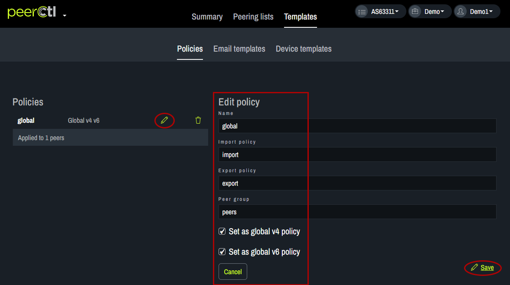
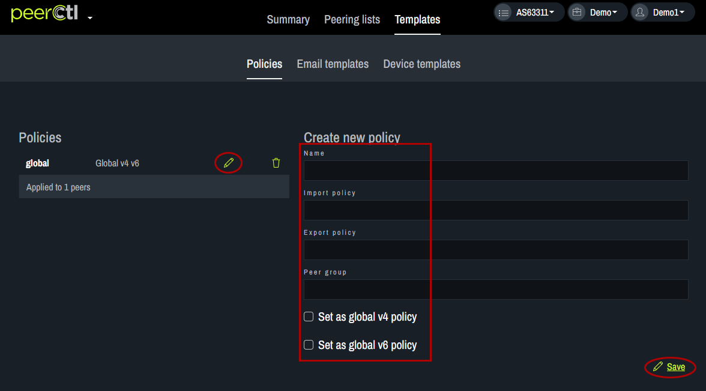
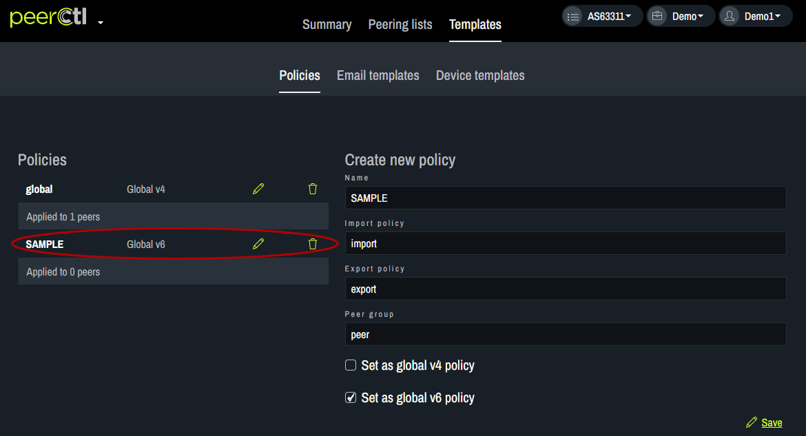
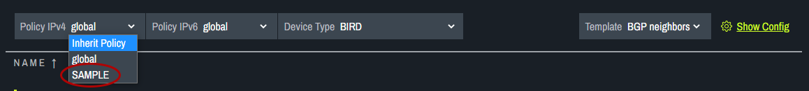

# Set Policy

Setting the Policy allows users to set the default router configuration at a given network. There are two options for setting the Policy: Global or Inherit Policy. The option chosen will be the default for all connections at this port.
   

Policy options can be modified using the Templates tab.
   

To modify the Global Policy, click on the pencil, enter the desired information, click Save.
   
   

To add a new Policy, enter the desired content and click Save. 
   
      

The newly added Policy will appear in the Policies list. It can be edited or deleted from here. It will also appear in the drop-down menu on the PeeringLists page.
   
   