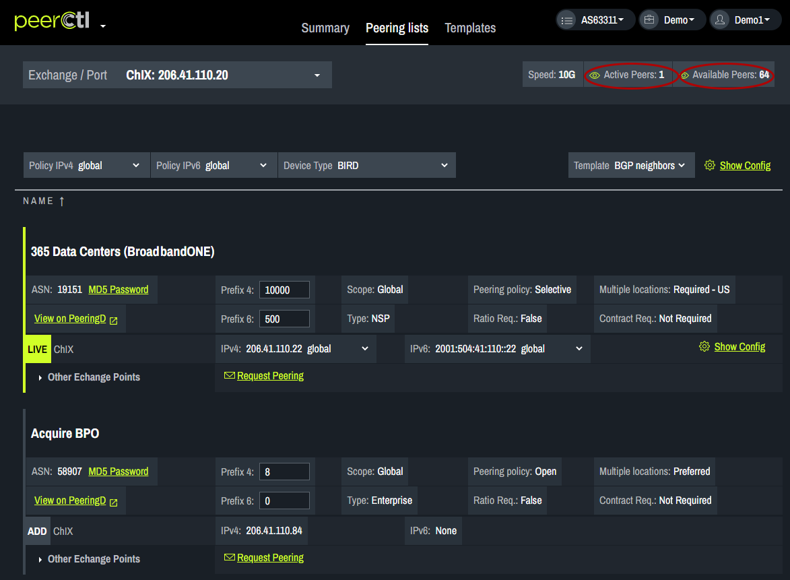

# Settings

Choose the Exchange/Port to be used from the drop down box on the left side of the window. The data displayed is populated from PeeringDB. 
<strong>Note: It is important to keep your PeeringDB account up-to-date to produce the most accurate data on PeerCtl.</strong>
    

Active network connections are indicated in green with the LIVE button highlighted. Clicking on Available network connections are indicated in gray with the ADD button highlighted.
   

Active Peers: When the icon is green a list of existing network connections is displayed. When the icon is white existing connections are hidden.

Available Peers: When the icon is green available network connections are displayed. When the icon is white available network connections are hidden. 
   

For each network, a list of common connections between your network and theirs can be viewed by clicking on the arrow next to Other Exchange Points.
   

