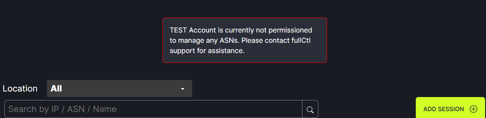

# ASN Permissions

To fully use PeerCtl, your account must be granted permission to manage ASNs. A message will appear until permission is granted.
   
   
ASN permissions can be granted by either [connecting your account to PeeringDB](https://docs.fullctl.com/aaaCtl/Sign-up-for-PeeringDB/) or contacting support@fullctl.com. Once permissions are granted your networks will appear in PeerCtl.
