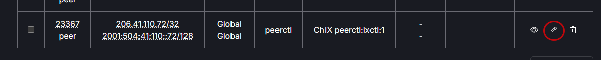

# Add Peering Session

To add a peering session, click on the Summary tab in the header menu. Select the Location to which a peering session will be added from the drop down menu at the top of the window. Click on the Add Session button.
   

In the modal, enter the desired information.
   

Existing sessions can be edited by clicking on the pencil icon next to the desired peer.
   
