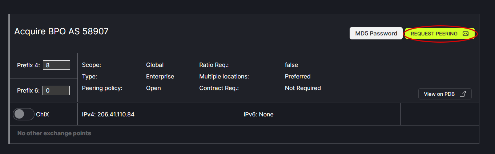
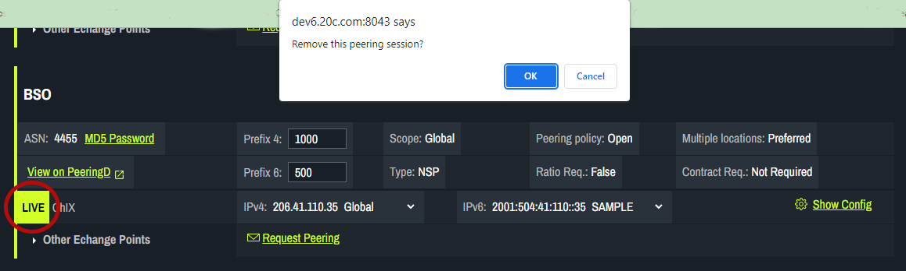

# Add/Remove Network Connection

To add a network connection, click on Request Peering. See Request Peering Option 2 for more details.
   
   
 To remove a network connection, click on  the green circle. A popup will challenge the removal to confirm or cancel the action. 
    
