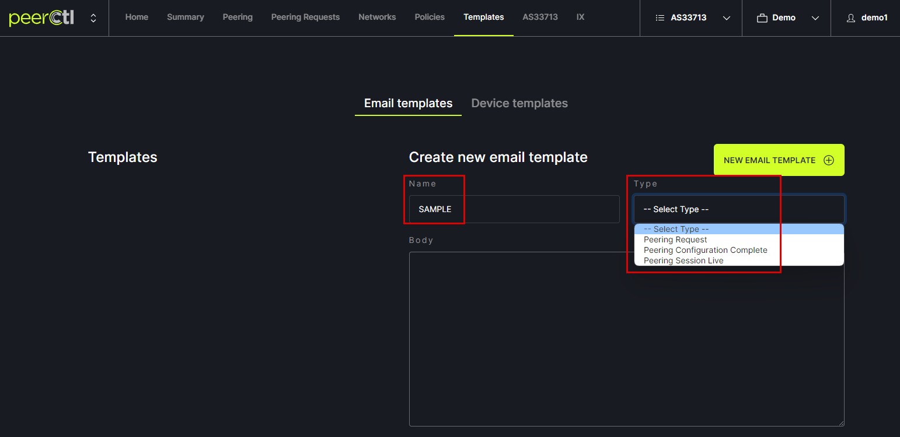
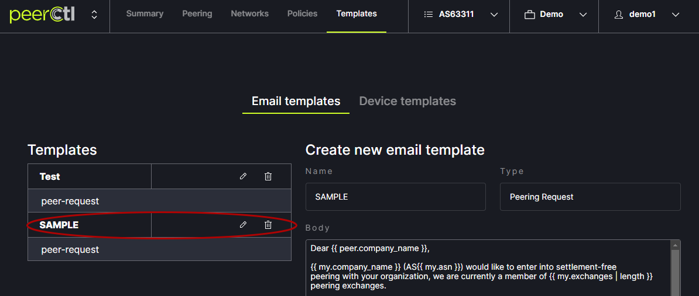

# Custom Email Templates

To create custom emails, click on the Templates tab at the top of the window. Then make sure to be on the Email templates tab.
   

Enter a name for the custom Template. Choose the Type of Template to be customized. Each type of template is based on one of the three steps in the Request Peering process. 
   
   
The default text will appear in the Body box and can be edited. Changes can be viewed in the Preview box below the Edit box. Edits are saved using the Save link at the bottom of the window. 
   
   
Note: The following variables autofill into the email based on your network settings. These variables should not be edited.

Example: [https://github.com/fullctl/peerctl/blob/prep-release/src/django_peerctl/templates/peerctl/email_template/peer-request.txt](https://github.com/fullctl/peerctl/blob/prep-release/src/django_peerctl/templates/peerctl/email_template/peer-request.txt)

- `peer` - peer network object
    - `peer.company_name` - organization name of the peer network
    - `peer.asn` - ASN of the peer network

- `my` - my network object
    - `my.company_name` - organization name of your network
    - `my.asn` - ASN of your network
    - `my.website` - URL of your website (as obtained from PeeringDB data)

- `mutual_locations` - list of mutually shared exchanges
    - `exchange.name` - name of the internet exchange
    - `exchange.ip4` - ip4 address
    - `exchange.ip6` - ip6 address

- `selected_exchanges` - list of selected exchanges when opening a peering request through the Networks view
    - `exchange.name` - name of the internet exchange
    - `exchange.ip4` - ip4 address
    - `exchange.ip6` - ip6 address

Note: List of jinja variables:

- `sessions` list of session objects available on `Session Configured` and `Session Live` emails

    - `session.peer_ip4` peer ipv4 address for the session
    - `session.peer_ip6` peer ipv6 address for the session
    - `ip4`: ipv4 address for the session
    - `ip6`: ipv6 address for the session
    - `prefix_length4`: max prefixes ipv4
    - `prefix_length6`: max prefixes ipv6

The newly added Template will appear in the Templates list. It can be edited or deleted from here.
   
   
Custom email Templates will appear in the Request Peering popup box.
   
