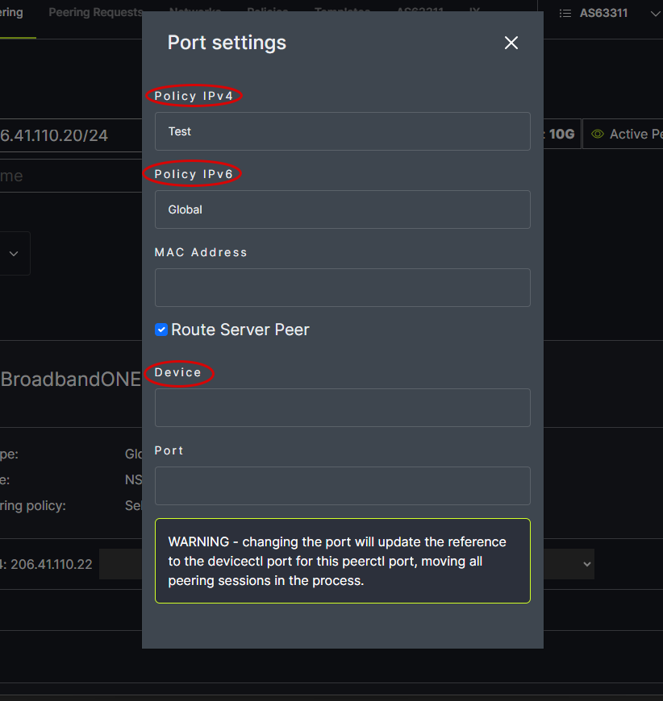

# Device Configuration

To view the current device configuration, click Show Config. The Show Config option at the top of the page provides access to the configuration settings for all the networks on the page. The Show Config option next to each network provides access to the configuration settings only for that particular network. 
   

The configuration specifications for the chosen Template will appear in the popup box. It can be copied for pasting into router configurations using the Copy to Clipboard option at the bottom of the box. 
   

The information in the device configuration is based on the chosen Policy, Device Type (set in the Port settings popup) and the Template (drop down below Exchange/Port). 
   
