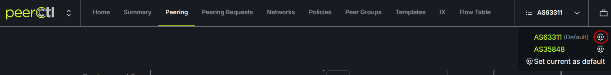

# Edit Network Settings

Information about the selected network (or asn) can be edited to override what comes from PeeringDB. To access the network settings page, click on the gear icon next to the ASN in the top right of the header menu. 
   
   

