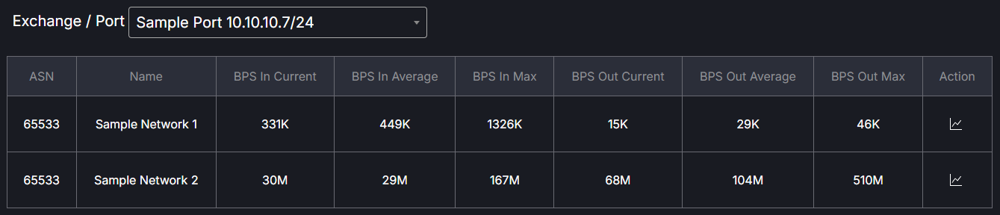

# Flow Table

The Flow Table tab provides a view of the IX members and connection speed at a given location. The flow table will only be populated if an IX has worked with the FullCtl team to set up data collection. 
   

The data in the table is connected via the member’s MAC address. The MAC address associated with each member must be entered in the member modal of ixCtl.
   

A graph of the data for each member to member relationship is available by clicking the Action icon.
   
