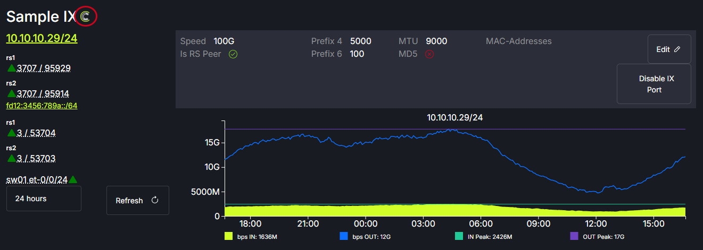

# IX View

The IX page of peerCtl displays the Internet Exchanges that the IX you are viewing is peered with. IXs with the FullCtl logo next to their name are part of the FullCtl system. If the IXs listed have worked with the FullCtl team to enable data collection they will display traffic graphs. 
   

The graph display can be modified using the drop down menu options.
   

Hovering over the route servers will display the number of routes received, advertised and length of time the connection has been established.
   

MAC addresses, MD5 passwords and traffic threshold alerts can be added by clicking on the Edit button.
   
   

The IX port can be disabled/enabled by clicking the Disable IX Port toggle.
   
