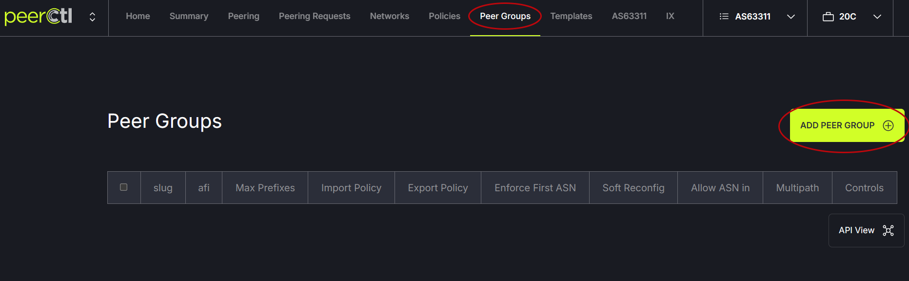

# Peer Group Policy

## Step 1 - Create the Policy
Click on the Peer groups tab in the header menu and click the Add Peer Group button. 

   

In the modal:

- Slug: Enter a slug (can be anything). 
- AFI: Enter either IPv4 or IPv6 (create the same policy twice, once for IPv4 and once for IPv6). 
- Max Prefixes: Enter the maximum number of prefixes.
- Import Policy: The policy format is: as{{session.peer_asn}}{{ session.tag | dash_if }}-in-v4

A glossary of options is below:

```
**Fields**

**peer_asn** (int | None) - Peer ASN (Autonomous System Number).

**peer_interface** (str | None) - Peer interface.

**ip4** (str | None) - IPv4 address.

**ip6** (str | None) - IPv6 address.

**peer_ip4** (str | None) - Peer IPv4 address.

**peer_ip6** (str | None) - Peer IPv6 address.

**peer_is_managed** (bool | None) - Indicates if the peer is managed.

**peer_name** (str | None) - Peer name.

**peer_session_type** (str | None) - Peer session type.

**peer_type** (str | None) - Peer type.

**policy4_export** (str | None) - Policy for exporting IPv4 routes.

**policy4_import** (str | None) - Policy for importing IPv4 routes.

**policy4_name** (str | None) - Policy name for IPv4.

**policy4_peer_group** (str | None) - Policy peer group for IPv4.

**policy4_inherited** (bool | None) - Inherited policy for IPv4.

**policy4_import_policy_managed** (int | None) - Policy import policy managed.

**policy6_export** (str | None) - Policy for exporting IPv6 routes.

**policy6_import** (str | None) - Policy for importing IPv6 routes.

**policy6_inherited** (<class 'NoneType'>) - Inherited policy for IPv6.

**policy6_name** (str | None) - Policy name for IPv6.

**policy6_peer_group** (<class 'NoneType'>) - Policy peer group for IPv6.

**port_interface** (str | None) - Port interface.

**port_is_ix** (bool | None) - Indicates if the port is IX (Internet Exchange).

**port_display_name** (str | None) - Display name of the Port.

**status** (str | None) - Status.

**acl_slug** (str | None) - ACL slug.
```

- Export Policy: The policy format is: as{{session.peer_asn}}{{ session.tag | dash_if }}-in-v4
- Choose the applicable checkboxes. Enforce first ASN, Soft reconfig, Multipath
- Allow ASN in [?]: Enter a number to specify the number of times the detection of the local device’s AS in the AS_PATH attribute is allowed.
- Save
  
   

## Step Two - Set the Policy

Click on the Policies tab in the header menu and click the New Policy button. 

   
   
- Name: Enter a name for the policy. Create mirrored versions for IPv4 and IPv6.
- Import Policy: Enter the slug used when creating the policy.
- Check the “FullCtl Manged” box. This will pull in the information from the Peer Groups policy that was created. FullCtl Managed means that FullCtl will create and delete policies as needed, if you’re using externally controlled policies, leaving this box unchecked will mean that FullCtl does not touch any policy config.
- Export Policy: Enter the slug used when creating the policy.
- Check the “FullCtl Manged” box. This will pull in the information from the Peer Groups policy that was created.
- Peer Group: field can be blank.
- FullCtl Manged: choose IPv4 or IPv6 based on which is being created
- Save

   
