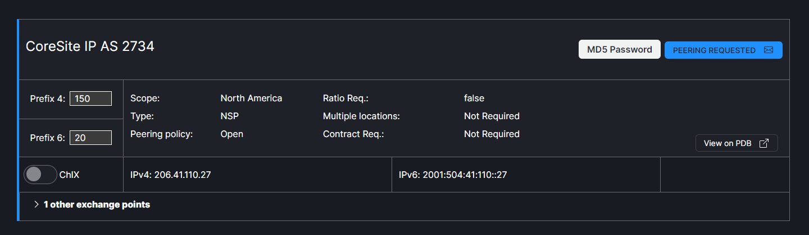

# Peering Process

### Step 1: Request

Once the Default or Custom email template has been chosen click Send. When the network receives the message they will reply to the email on file with your PeeringDB account.
   

The session will now appear blue and indicate pending.
   

### Step 2: Configured

Once the network has confirmed the request, provided configuration information and the connection has been configured, the next step is to confirm this with the network. Click on the Request Peering link for the desired network. The Configured step will be highlighted in the Workflow. Choose the Default or Custom email template and click Send.
   

### Step 3: Session Live

When the request has been completed, click on the Request Peering link for the desired network. The Session Live step will be highlighted in the Workflow. Choose the Default or Custom email template and click Send. 
   
   
The network will now appear green.
   
