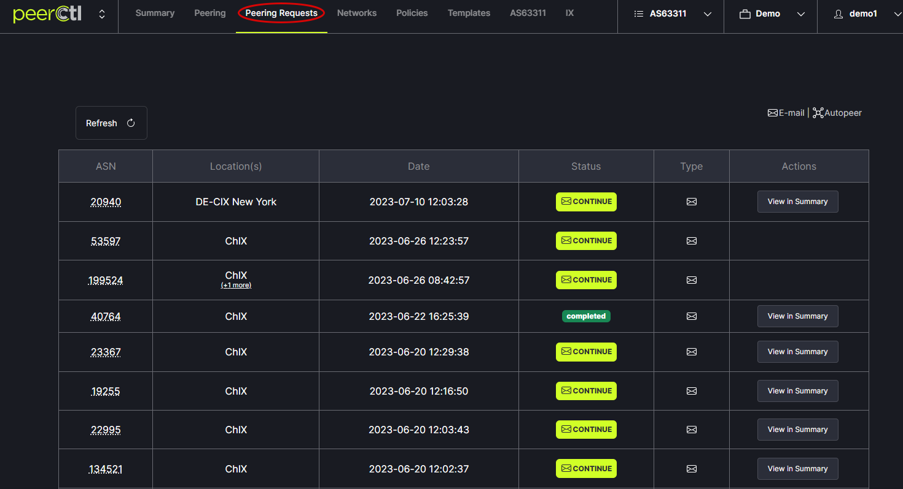
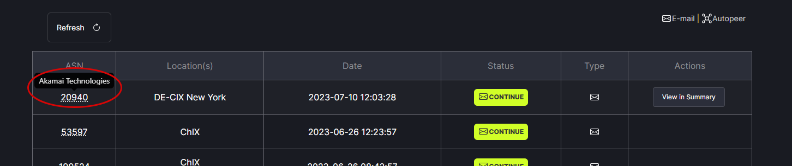
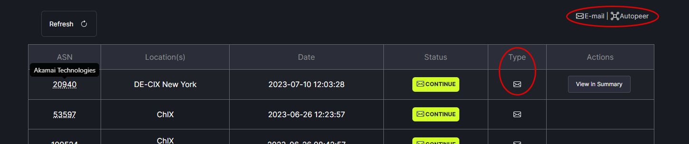

# Peering Requests Summary

The Peering Requests page identifies the status of each peering request. It is noted as complete, failed or has a button to continue the peering process. 
   

Hovering over the ASN will show the ASN name.
   

The Type field indicates whether the peer session was created via email or automatically. 
   
