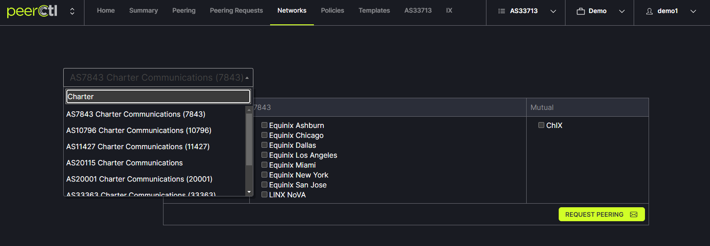

# Request Peering Option 1

There are two options for requesting peering with a new network. One option is from the Peering page. Another option is from the Network page. 

Network page option: 
Click on the Network tab in the header menu. Then enter the ASN or name of the network to which peering is desired. 
   
   
Check the desired boxes for connections and click on the Request Peering button.   
   
   
In the popup box, choose the desired template and click Send.
   
