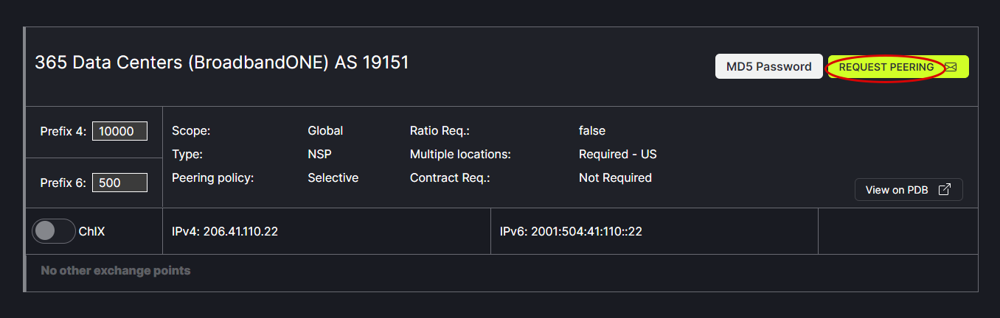
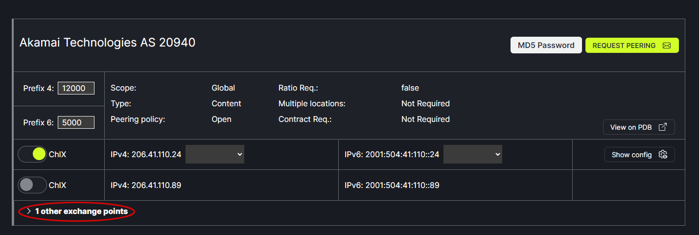
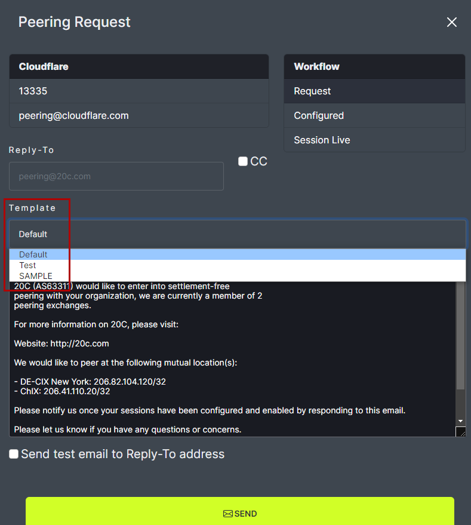

# Request Peering Option 2

There are two options for requesting peering with a new network. One option is from the Peering page. Another option is from the Network page.

Peering page option:
Click on the Peering tab in the header menu. Then, click on Request Peering.
   

Note: When a peering request is made it includes all the shared exchange points. The shared exchange points can be viewed by clicking the arrow next to Shared Exchange Points.
   

In the popup box, on the top left is the network name, ASN and email contact.
   

The top right shows the workflow indicating the current stage of the network connection process. 

- Request indicates the user is making a new network connection request.
- Configured indicates both parties have done their network configuration.
- Session Live indicates the connection is complete.

   

For each step of the Request Peering process, an email is sent to the network of interest. The default email option can be used or a custom email can be created. The default email appears in the Request Peering popup box. Custom email Templates will appear in the drop down menu.
   
