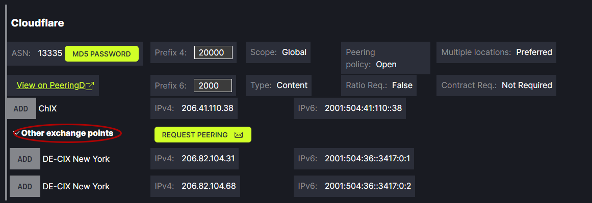
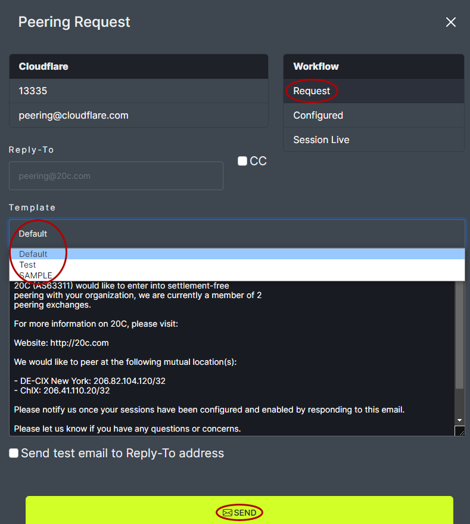
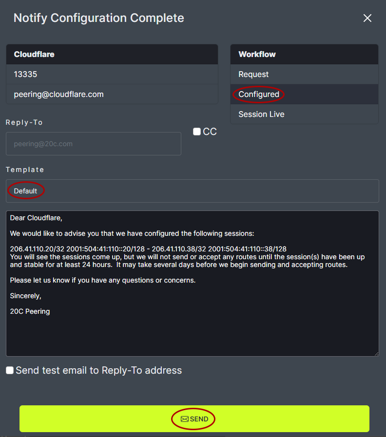
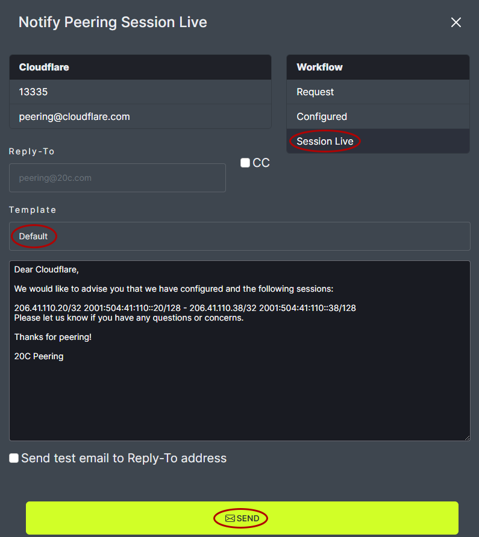

# Request Peering

To request peering with a new network, click on Request Peering..
   

Note: When a peering request is made it includes all the shared exchange points. The shared exchange points can be viewed by clicking the arrow next to Shared Exchange Points.
   

In the pop-up box, on the top left is the network name, ASN and email contact.
   

The top right shows the workflow indicating the current stage of the network connection process.
Request indicates the user is making a new network connection request.
Configured indicates both parties have done their network configuration.
Session Live indicates the connection is complete.
   

For each step of the Request Peering process, an email is sent to the network of interest. The default email option can be used or a custom email can be created. The default email appears in the Request Peering pop-up box. Custom email Templates will appear in the drop down menu.
   

**Custom Email Templates**

To create custom emails, close the Request Peering pop-up box and click on the Templates tab at the top of the window.
   

Click on Email Templates at the top of the window.
   

Enter a name for the custom Template. Choose the Type of Template to be customized. Each type of template is based on one of the three steps in the Request Peering process. The default text will appear in the Body box and can be edited. Changes can be viewed in the Preview box below the Edit box. Edits are saved using the Save link at the bottom of the window. Custom email Templates will appear in the Request Peering pop-up box.

Note: The following variables autofill into the email based on your network settings. These variables should not be edited.

Example: [https://github.com/fullctl/peerctl/blob/prep-release/src/django_peerctl/templates/peerctl/email_template/peer-request.txt](https://github.com/fullctl/peerctl/blob/prep-release/src/django_peerctl/templates/peerctl/email_template/peer-request.txt)

- `peer` - peer network object
    - `peer.company_name` - organization name of the peer network
    - `peer.asn` - ASN of the peer network

- `my` - my network object
    - `my.company_name` - organization name of your network
    - `my.asn` - ASN of your network
    - `my.website` - URL of your website (as obtained from PeeringDB data)

- `mutual_locations` - list of mutually shared exchanges
    - `exchange.name` - name of the internet exchange
    - `exchange.ip4` - ip4 address
    - `exchange.ip6` - ip6 address

- `selected_exchanges` - list of selected exchanges when opening a peering request through the Networks view
    - `exchange.name` - name of the internet exchange
    - `exchange.ip4` - ip4 address
    - `exchange.ip6` - ip6 address

Note: List of jinja variables:

- `sessions` list of session objects available on `Session Configured` and `Session Live` emails

    - `session.peer_ip4` peer ipv4 address for the session
    - `session.peer_ip6` peer ipv6 address for the session
    - `ip4`: ipv4 address for the session
    - `ip6`: ipv6 address for the session
    - `prefix_length4`: max prefixes ipv4
    - `prefix_length6`: max prefixes ipv6

   

The newly added Template will appear in the Templates list. It can be edited or deleted from here.
   

**Peering Process**

Step 1: Request

Once the Default or Custom email template has been chosen click Send. When the network receives the message they will reply to the email on file with your PeeringDB account.
   

Step 2: Configured

Once the network has confirmed the request, provided configuration information and the connection has been configured, the next step is to confirm this with the network. Click on the Request Peering link for the desired network. The Configured step will be highlighted in the Workflow. Choose the Default or Custom email template and click Send.
   

Step 3: Session Live

When the request has been completed, click on the Request Peering link for the desired network. The Session Live step will be highlighted in the Workflow. Choose the Default or Custom email template and click Send. The network will now show as LIVE and appear green.
   
   
