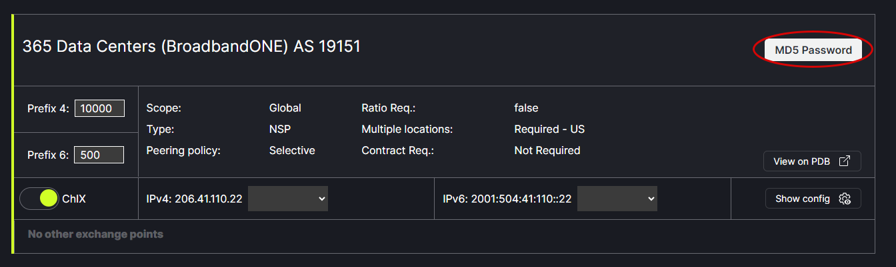

# Set MD5 Password

Using the MD5 Password link you can set the password for the desired network session configuration.
   

In the popup box, type the desired password and click Save.
   

To view the password, click on Show Config for the network. The password will appear in the popup box configuration.
   
