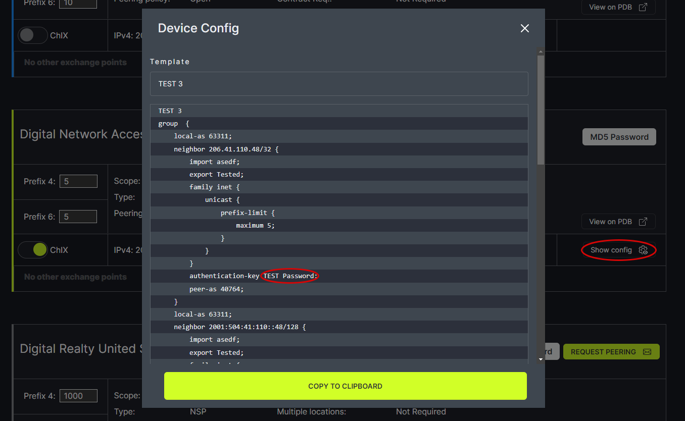

# Set MD5 Password

Using the MD5 Password link you can set the password for the desired network session configuration.
   

In the pop-up box, type the desired password and click Save.
   

Click on Show Config for the network. In the pop-up box, the password appears in the configuration after “authentication-key.”
   
