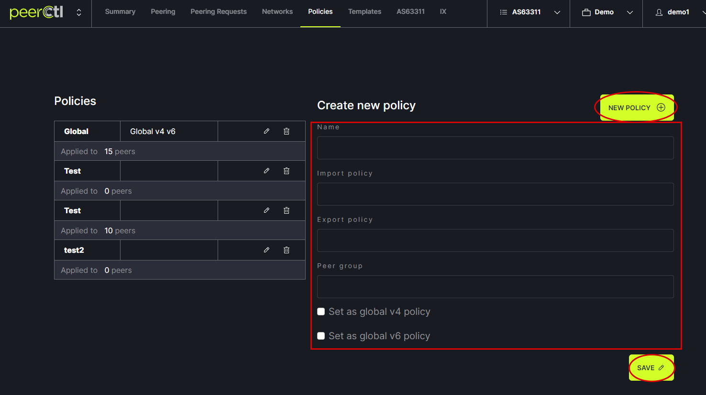
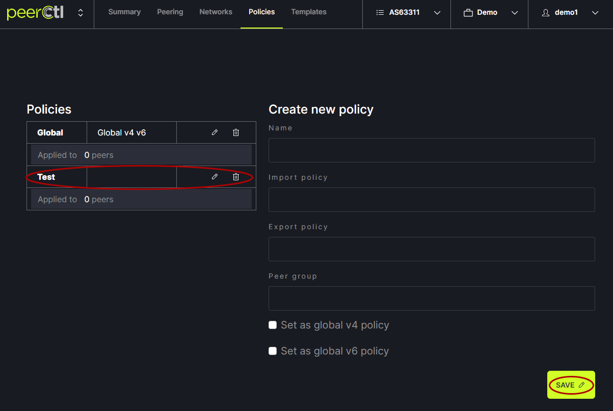

# Set Policy & Device Type

Setting the Policy allows users to set the default router configuration at a given network. There are two default options for setting the Policy: Global or Inherit Policy. Custom policies can also be created. The option chosen will be the default for all connections at this port. To choose a policy, click on the gear icon next to the Exchange/Port.
   

In the Port settings popup, choose the desired Policy and Device type settings and close the popup.
   

Policy options can be modified using the Policies tab in the header menu.
   

To modify the Global Policy, click on the pencil, enter the desired information, click Save.
   

To add a new Policy, enter the desired content and click Save. The Global Policy option must be saved or canceled out (lower left of Global Policy text area) to add a new Policy.
   

The newly added Policy will appear in the Policies list. It can be edited or deleted from here. 
   

It will also appear in the drop-down menu in the Port settings popup.
   
