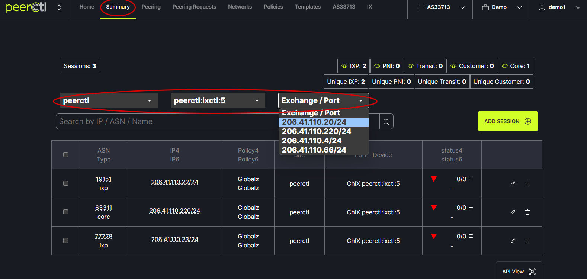

# Summary View
If your Organization has more than one network there will be a Home tab in the header menu. From the Home page you can switch between networks. You can also switch between networks using the drop down option in the header menu.
   

Once the ASN has been chosen, click on the Summary tab. Using the drop down menus above the search box choose the Location, Device and Exchange/Port of the BGP session to be viewed. If no data is entered for one of these fields the drop down menu will not be visible. 
   
