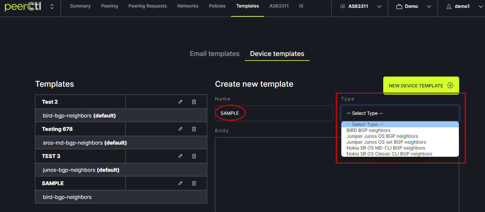

# Templates

After setting your Policies and Device type in the Port settings popup, choose the desired Template. Templates can be added or edited using the Templates tab in the header menu. 
   
   
Choose the Device Templates tab. 
   

Edit or delete existing Templates using the options on the left. 
   

Add a new Template by entering a Name, choosing the Type from the drop-down menu, editing the text in the Body and clicking Save.
   

The newly added Template will appear in the Templates list. It can be edited or deleted from here.
   

It will also appear in the Device Config popup box. To view, click on Show config. 
   

The new Template will appear in the popup box drop down menu
   
 
The configuration specifications for the new Template will appear in the popup box. The text can be copied for pasting into router configurations using the Copy to Clipboard option at the bottom of the box. 
Note: The following variables autofill into the email based on your network settings. These variables should not be edited. 
Example: https://github.com/20c/netom/blob/master/src/netom/templates/netom0/bird1-0/bgp/neighbors.j2
- `device.type` - device type 
- `peer_groups` - a `dictionary` of peers with group name as key
- `peer.peer_as` - ASN of the peer
- `peer.name` - Name of the peer
- `peer.neighbor_address` - ip address of neighbor
- `peer.local_as` - local asn
- `peer.auth_password` - md5 
- `peer.max_prefixes` - max number of prefixes
- `peer.import_policy` - import policy
- `peer.export_policy` - export policy
