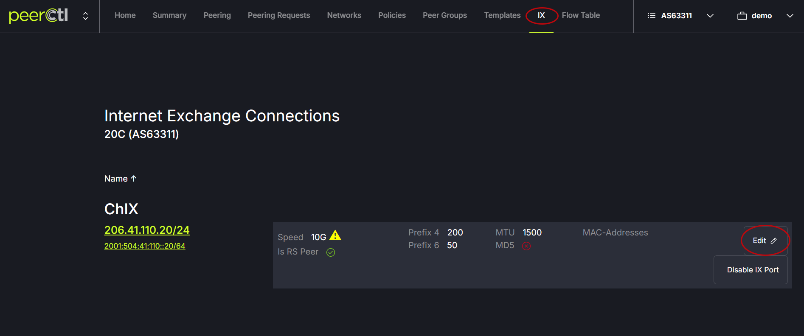
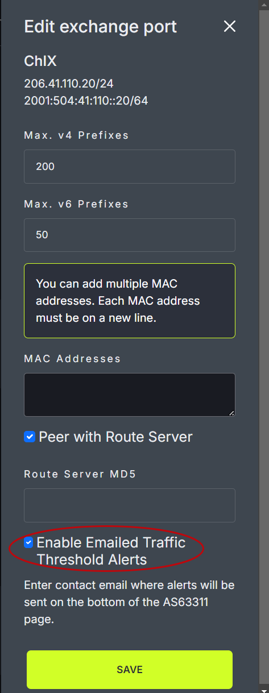
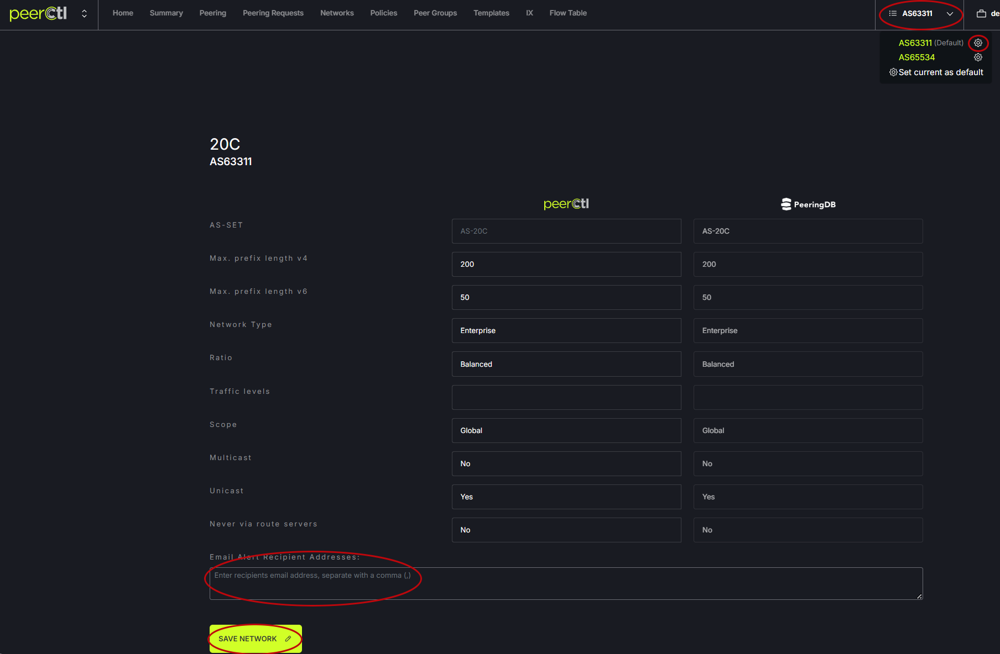
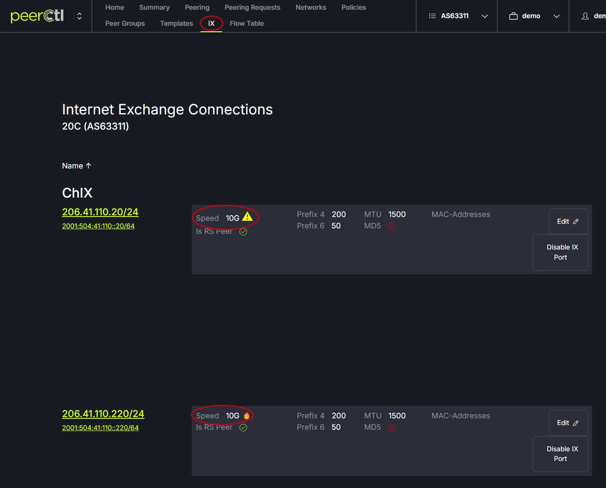
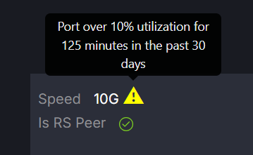

# Traffic Alerts

PeerCtl will show traffic alerts if this feature has been configured by your IX Operator. The alerts indicate that traffic has exceeded a given percentage for a specified period of time. For example, higher than 90% utilization for more than 24 hours. 

## Email Alerts
There is an option to turn on an email alert for alerts as well. There are two steps to enable email traffic alerts. 

### Step 1
Click on the IX tab in the PeerCtl header menu. Then click the Edit button. Check the box for Enable Emailed Traffic Threshold Alerts. Click Save.
   
   

### Step 2
Click on the ASXXX tab in the upper right side of the window. Then click the gear icon next to the AS. Enter the delivery email address(s) in the Email Alert Recipient Address box. Click Save.
   

Traffic alerts are seen on the IX page next to the speed. 
   

## Alert Indicators
When the traffic alert feature is activated, two types of traffic alert indicators appear.

- Yellow triangle = alert was triggered in the past 30 days but is not currently active
- Red flame = alert is currently active (resets to yellow if traffic drops below threshold)

   
   
