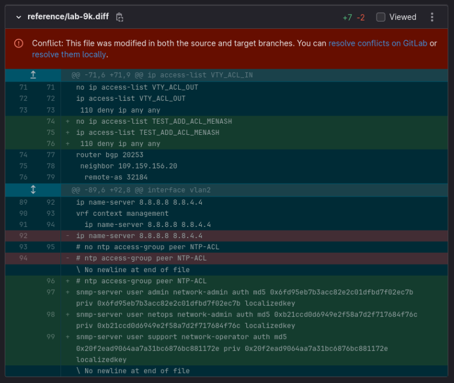

# Change Requests

**Conflicts**

Sometimes there will be merge conflicts when dealing with change sets, as shown:

   

This simply means that more than one source changed the device config at the same time.

_This happens more frequently in development environments than in production._

To have the change pushed, you need to manually fix the conflict, then when you merge it will get pushed to the devices.
