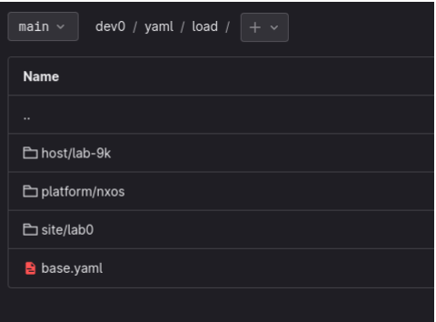

# Source of Truth Data Loading

The source of truth data is a multi-tiered inherited database.

### Order of Operations

1. from API calls (FullCtl, Nautobot, etc)
2. from yaml templates
3. from snippets

### Order of Groups

1. Base
2. Platform
3. Site`
4. Tag
5. Host

Data is loaded and inherited from these sources in the listed order so as to allow data overrides in a change controlled environment.

In the following example, for an NXOS device named `lab-9k` at site `lab0`, it will load in order:

1. All files in the directory, so `basesys.yaml` 
2. `platform/nxos` 
3. `site/lab0`
4. `host/lab-9k`
   
