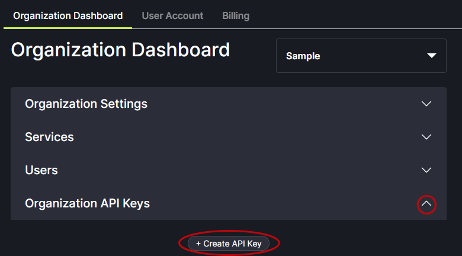
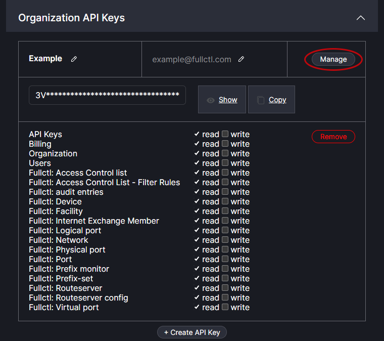
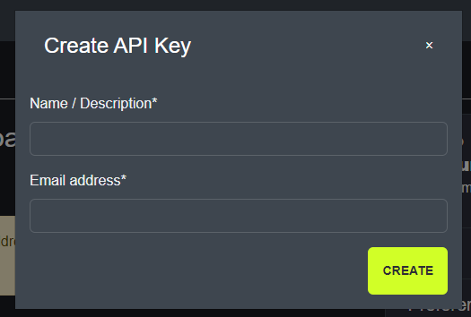
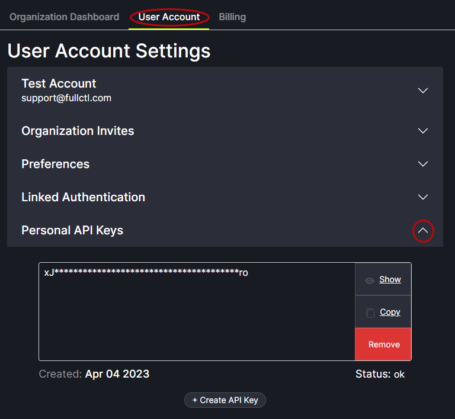

# API Keys

## Organizational API Keys

Organizational API Keys can be added to an Organizational account. From the Organization Dashboard tab, click the drop arrow on the right side of the API Keys field to display the Create API Key button. 
   

Clicking on the Mange button allows Users to set read/write permissions and view the API key.
   
   
Enter the Name and Email address and click Create.
   

## Personal API Keys

Personal API Keys can be added to a User account. From the User Account tab, click the drop arrow on the right side of the Personal API Keys field to display the API Key information.
   
