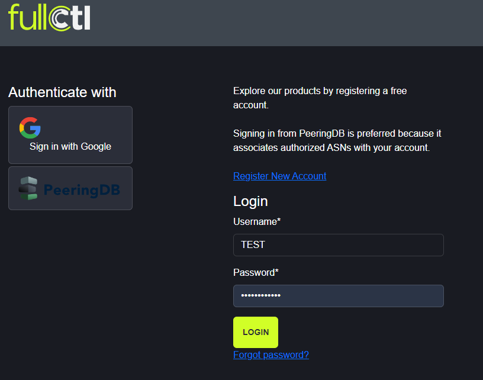
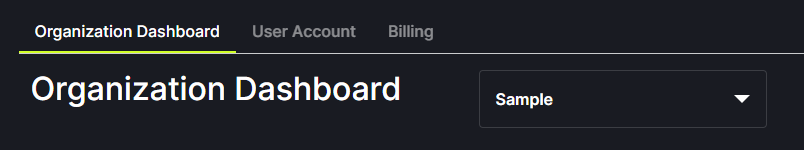
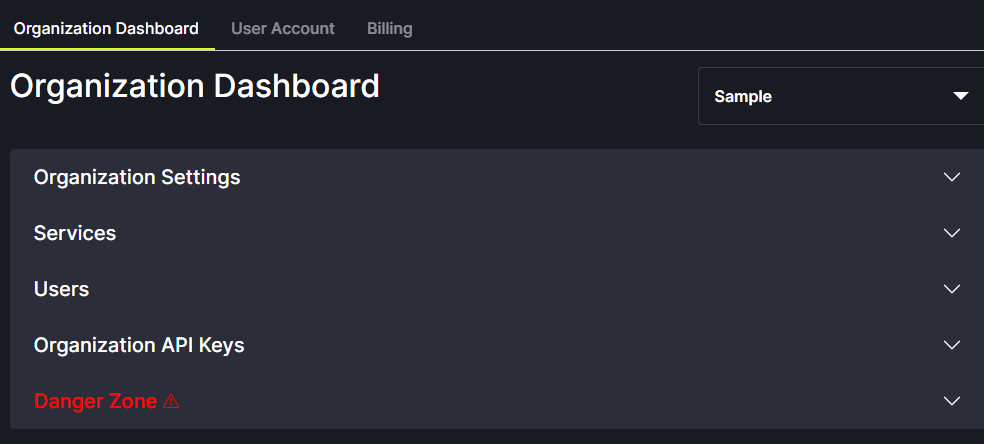
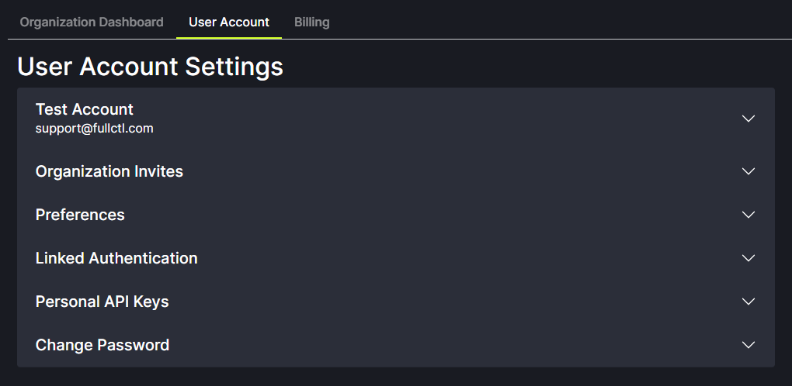

# Account Dashboard

To view the FullCtl Account Dashboard (aka aaaCtl), go to: [account.fullctl.io](https://account.fullctl.io), enter username (or email address)  and password and click Login.
   

The Account Dashboard has three tabs - Organization Dashboard, User Account and Billing.
   

**Organization Dashboard** = access to FullCtl applications, Users and Organization API Keys. This information is managed by Organization Administrators.

**User Account** = edit personal account information, view Organization invitations, change preferences, access authentication, set personal API keys, and change password

**Billing** = add billing contact/method, view service charges, see order history

## Organization Account Settings

The following options are in the  Organization Dashboard:

- Organization Settings: Update organization name and password
- Services: Description of and link to FullCtl applications
- Users: List of Users within your Organization. User settings can be updated here
- Organization API Keys: Create and edit the Organization API key
- Danger Zone: Leave or delete the Organization

   

## Personal Account Settings

The following options are in the User Account area:

- Account Information: Update email, name and username
- Organization Invites: View pending invitations to join other Organizations in FullCtl
- Preferences: Opt in/out of release note email updates from FullCtl
- Linked Authentication: Connect your account to PeeringDB or Google
- Personal API Keys: Access your personal API key
- Change Password: Update your FullCtl account password

   
