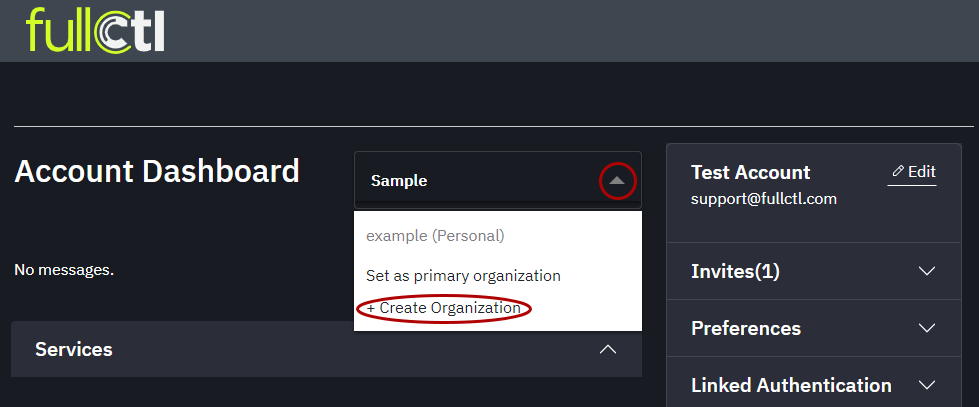
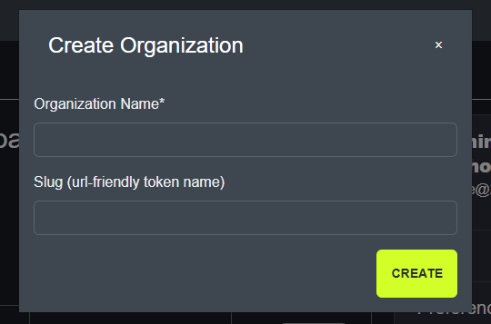
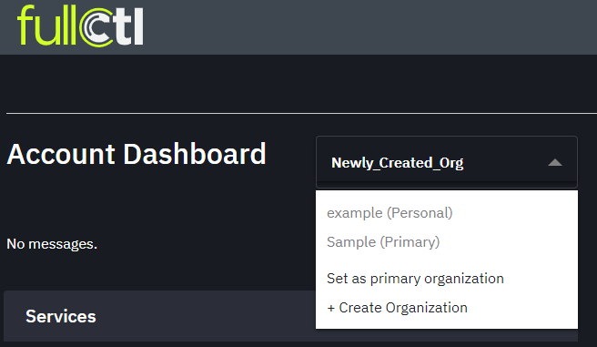

# Add Organization

An Organization can be added using the drop-down arrow next to name then clicking on + Create Organization. Different Organizations can subscribe to different FullCtl services.
   
   
Enter the Organization Name, Slug and click Create. 

   
   
The new Organization will then appear next to the drop-down arrow. Your personal account and Organization you entered upon account creation will appear in the drop down menu.    
   
