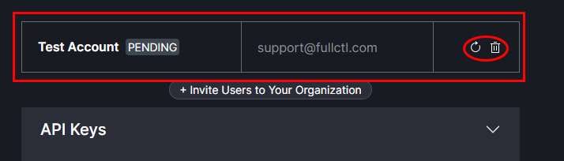

# Add Users

Choose the Organization you want to add users to. Your list of Organizations can be found using the drop-down arrow next to name.
   

Click on + Invite Users to Your Organization. In the pop-up box, enter the email address of the person you are inviting. Click on Send Invite. The person invited will receive an email with a link to accept the invitation. If they do not receive the message, there is a link to Re-Send the Invitation. When they click on the link in their email they will be directed to the 20C website to create an account. If the person already has an account, pending invitations will appear in the right-side menu bar under Invites.
   

Pending invitations will appear grayed-out in the Support Account area.
   

After a new user has accepted the invitation and created an account their name will appear in the list of Users. To assign User privileges, click on the Mange button next to the Users name.
   

