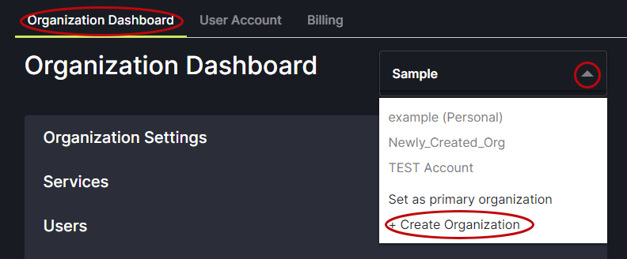
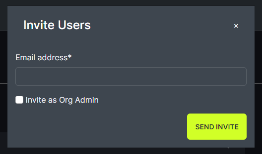
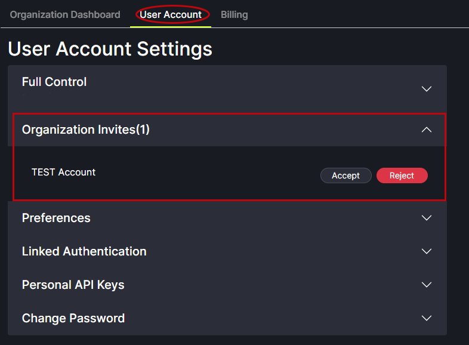
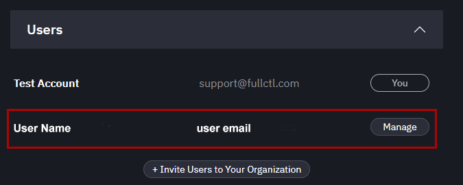

# Add Users

Choose the Organization you want to add users to. Your list of Organizations can be found using the drop-down arrow next to name.
   

Click on + Invite Users to Your Organization from the options below Services.
   
   
In the pop-up box, enter the email address of the person you are inviting. Click on Send Invite. 
   

The person invited will receive an email with a link to accept the invitation. When they click on the link in their email they will be directed to the FullCtl website to create an account. If the person already has an account, pending invitations will appear in the right-side menu bar under Invites.
   

Pending invitations will appear in the User list. There is an option to resend the Invitation. There is also an option to delete the pending invitation.
   

After a new user has accepted the invitation and created an account their name will appear in the list of Users. To assign User privileges, click on the Mange button next to the Users name.
   

The User will see the new Organization in the dropdown list next to their name.
   
