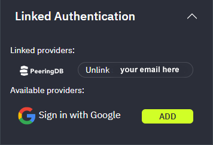

# Authentication

A message prompting you to authenticate will appear at the top of the window until you complete authentication. Authenticating helps FullCtl relate your networks to your organizations. To authenticate, either click on the button in the message or go to the User Account tab can click on the Linked Authentication drop-down. 

PeeringDB is the preferred method for authentication. Please contact us for information on how to set up Okta-backed authentication.
   

You will be directed to the PeeringDB website. Make sure you are logged into the site. Click on Authorize.
   

You will be redirected to the FullCtl website. When you click on Linked Authentication option on the right side of the screen you will see PeeringDB under Linked Providers.
   
