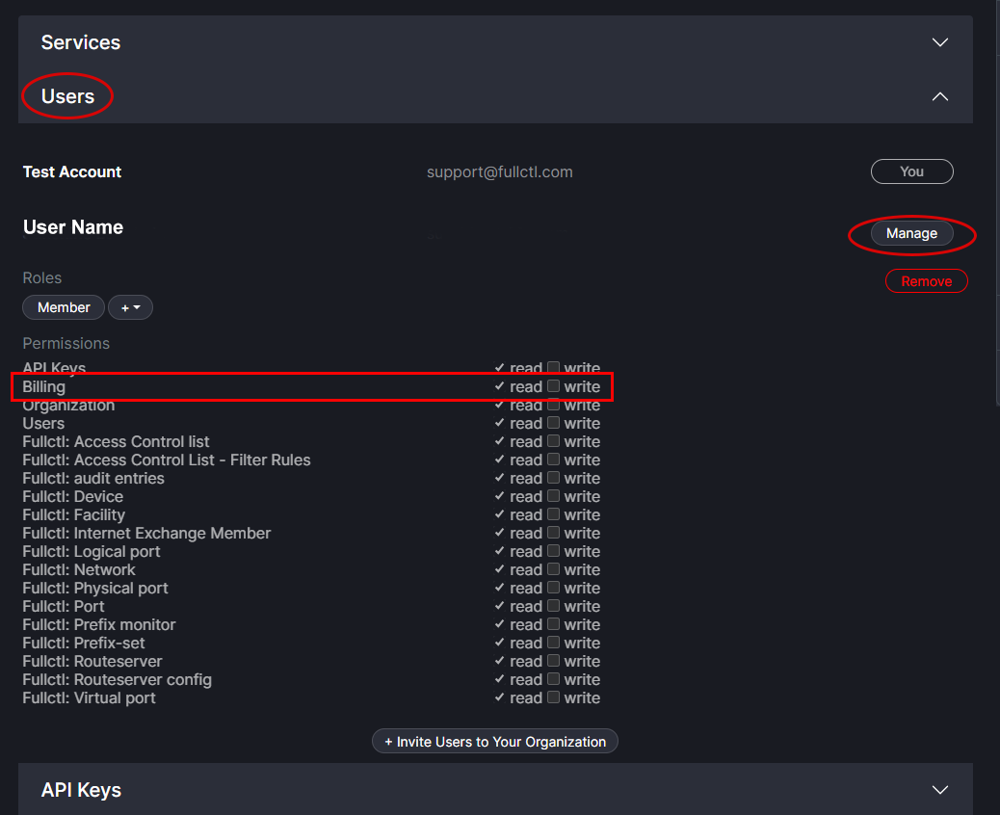
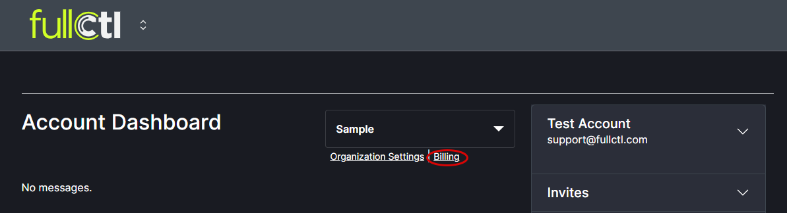
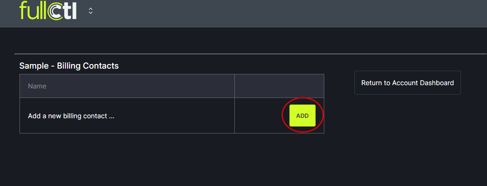
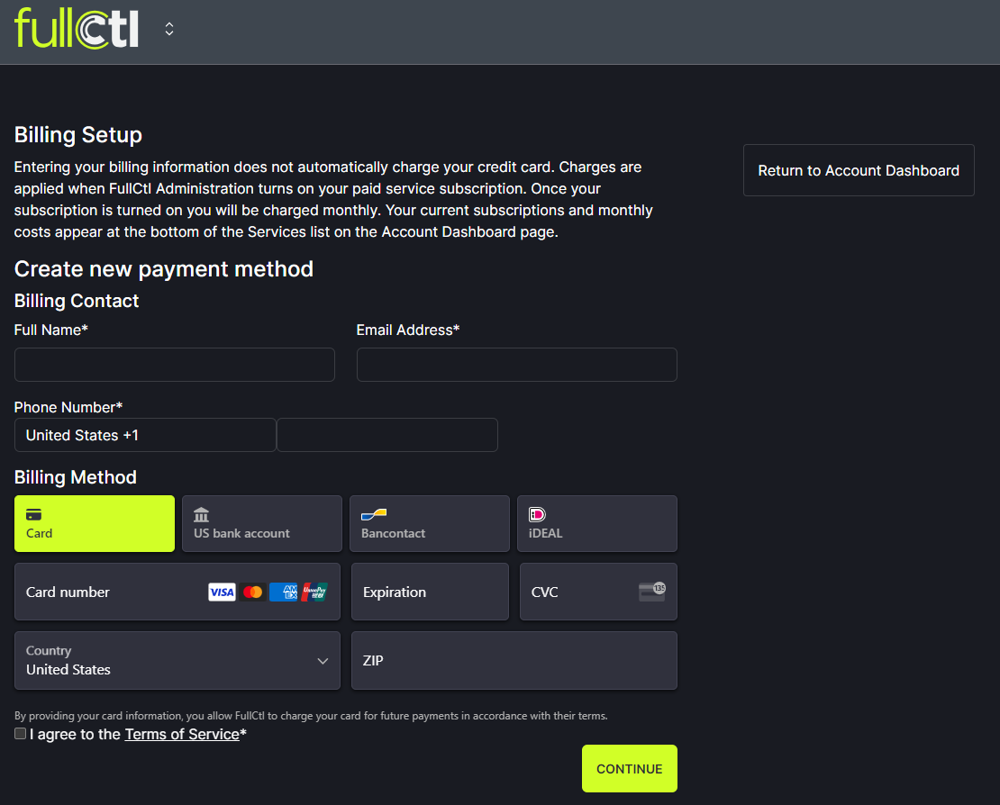
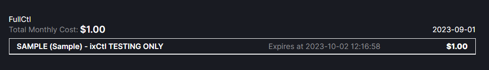
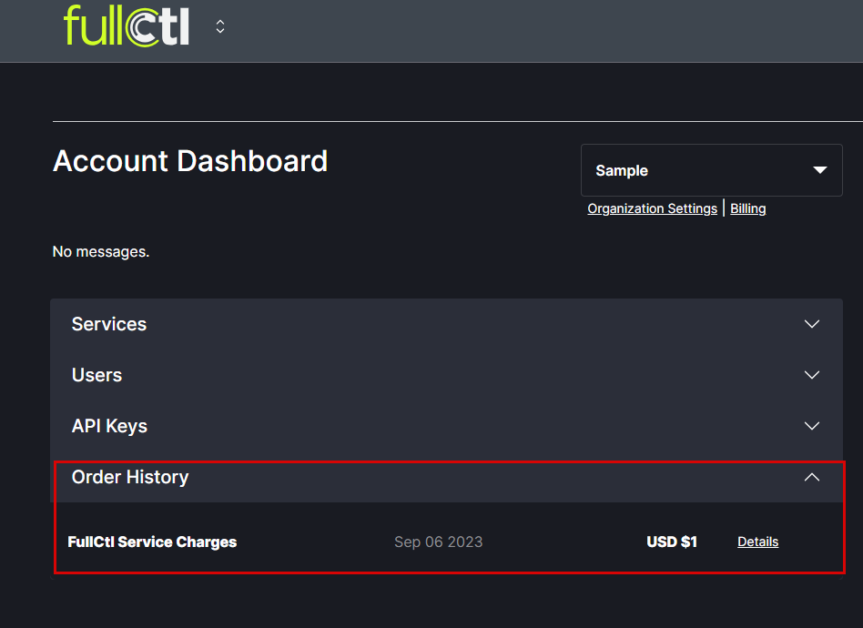
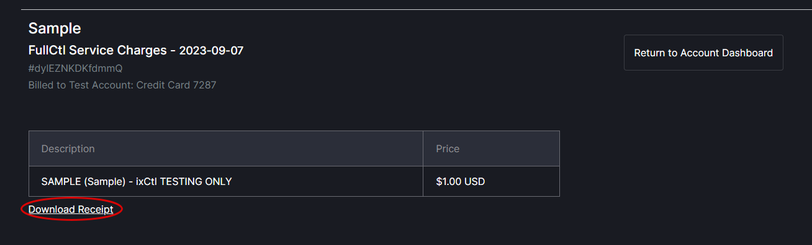

# Billing

Billing information can only be added by Organization Admins or by Users who have been granted read/write access to the billing option by Organization Admins. To grant read/write permissions for a User, go to the Users section of aaaCtl. Click on the Manage button next to the User's name. Under Permissions, check the write box for Billing.
   

To enter billing information, click on Billing below your Organization name.
   

Click the Add button to add a new billing contact.
   

Enter your name, email, address and credit card information. Read the [Terms of Service](https://www.fullctl.com/legal#section=collapseToS) and check the box. Click Continue.
Note: If a second billing contact and credit card is added for your Organization, the system will automatically charge the newest credit card added. If you would like a different card to be charged please contact support@fullctl.com.
   

Entering your billing information does not automatically charge your credit card. Charges are applied when FullCtl Administration turns on your paid service subscription. Once your subscription is turned on you will be charged monthly. Your current subscriptions and monthly costs appear at the bottom of the services list.
   

Your past payments can be viewed by expanding Order History.
   

Clicking on details will bring up a page with an option to download a receipt. 
   
