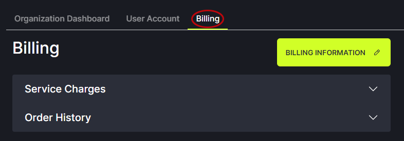
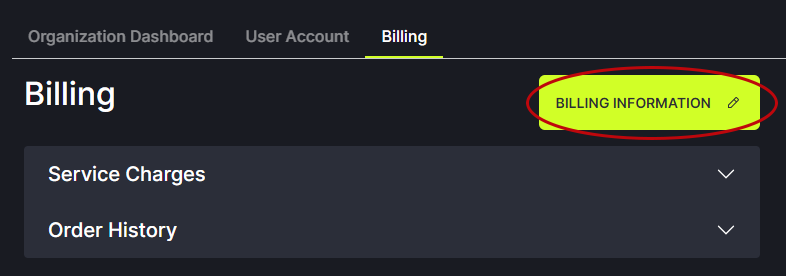

# Billing

Billing information can only be added by Organization Admins or by Users who have been granted read/write access to the billing option by Organization Admins. To grant read/write permissions for a User, go to the Users section of aaaCtl. Click on the Manage button next to the User's name. Under Permissions, check the write box for Billing.
   

To view billing information, click on the Billing tab in the header.

   

Click on the Billing Information button to enter the billing contact information and method.
   

Click the Add button to enter a new billing contact person or method. 
   
   
Enter your name, email, address and credit card information. Choose a payment method and enter credit card or ACH details. Read the [Terms of Service](https://www.fullctl.com/legal#section=collapseToS) and check the box. Click Continue.

Note: If a second billing contact and credit card is added for your Organization, the system will automatically charge the newest credit card added. If you would like a different card to be charged please contact <support@fullctl.com>.
   

Entering your billing information does not automatically charge your credit card. Charges are applied when FullCtl Administration turns on your paid service subscription. Once your subscription is turned on you will be charged monthly. Your current subscriptions and monthly costs appear in the Service Charges list. Click the arrow to expand the list.
   

Your past payments can be viewed by expanding Order History.
   

Clicking on details will bring up a page with an option to download a receipt. 
   
