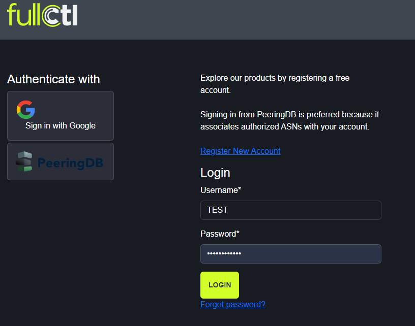
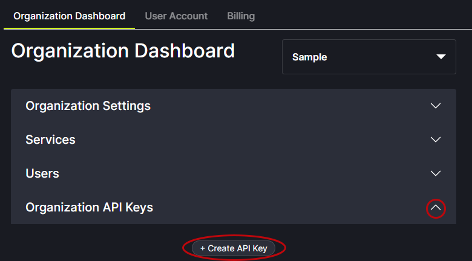
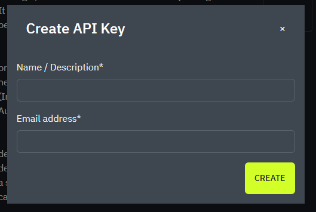

# Log In and Update Settings

Go to: [account.fullctl.io](https://account.fullctl.io).

Enter username and password and click Login.
   

Once logged in, there is access to the Account Dashboard. From the Dashboard, use the menu on the right to edit account information, change preferences, access authentication and personal API key information, and change password. The services section provides access to the different FullCtl products. Use the drop-down arrow next to your name to switch between accounts.
   

Organizational API keys can be added to an account. Click on the Create API Key button.
   

Enter the Name and Email address and click Create.

   

When invited to join an Organization, users receive an email with a link to accept the invitation. Pending invitations also appear in the right-side menu.
   
