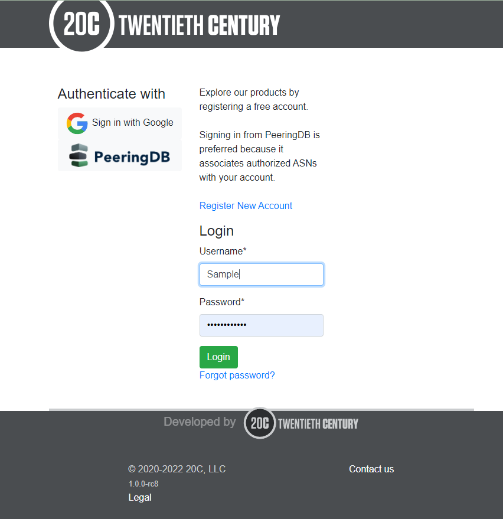
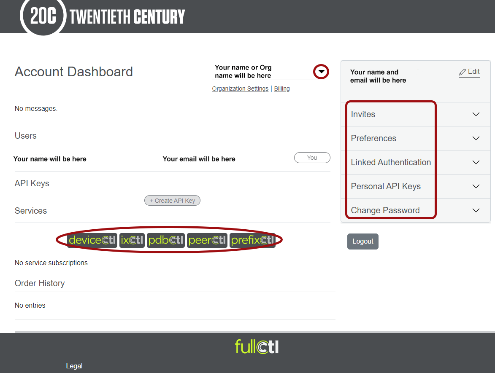
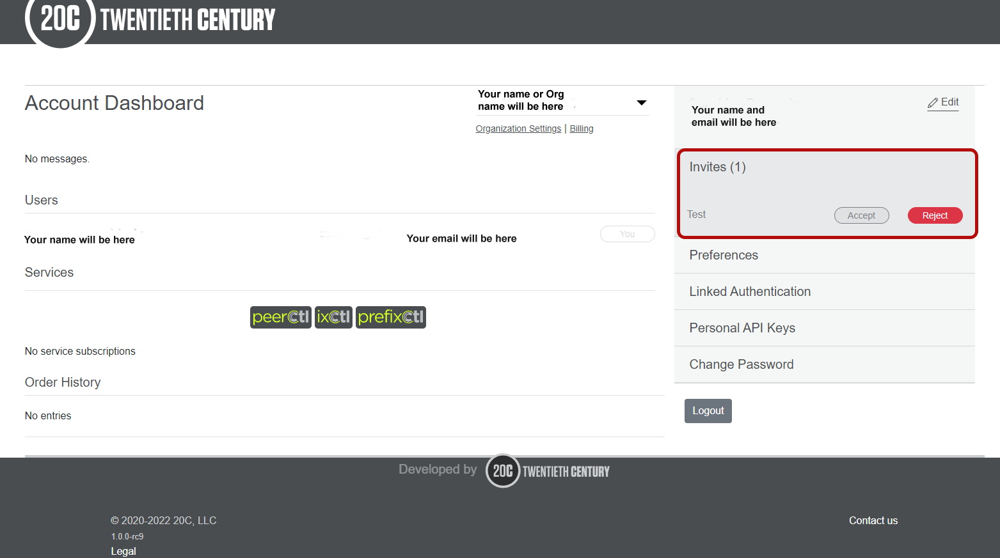

# Log In and Update Settings
1. Go to: account.20c.com.
2. Enter your username and password and click Login.
   
3. Once you have logged in you will have access to your Account Dashboard. From the Dashboard, you can use the menu on the right to edit your account information, change preferences, access authentication and API key information and change your password.
You can access the different 20C products in the Services section.
You can switch between accounts using the drop-down arrow next to your name.
   
4. When you are invited to join an Organization, you will receive an email with a link to accept the invitation. Pending invitations also appear in the right-side menu.
   
