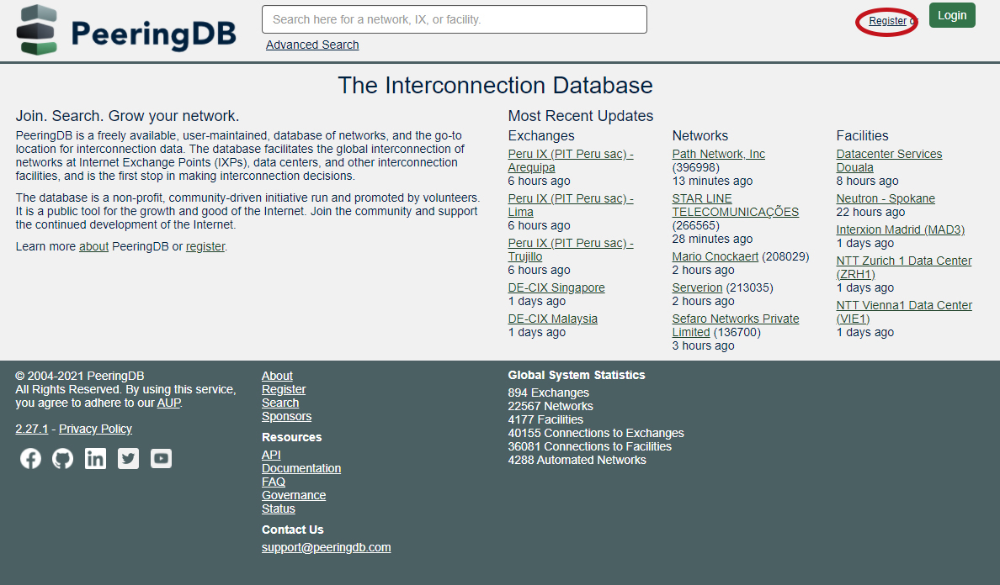
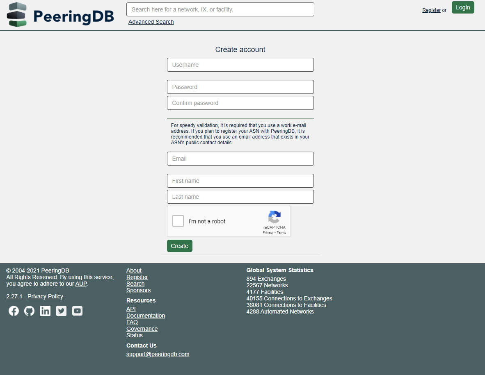
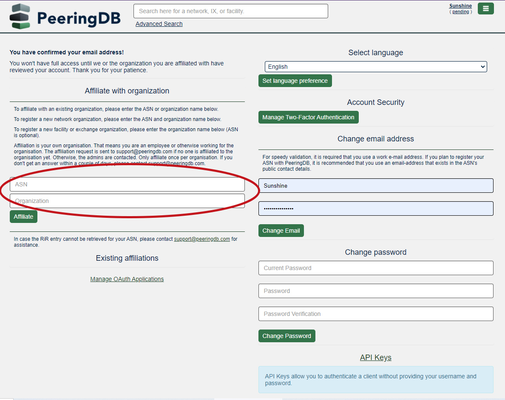
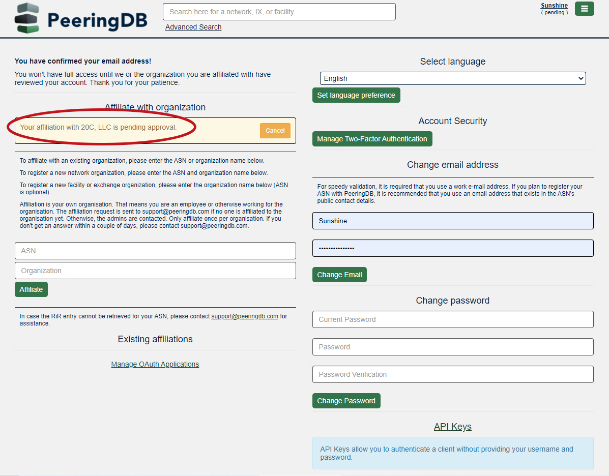

# Sign up for PeeringDB

1. Go to: peeringdb.com.
2. Click on “Register” in the upper right corner of the screen.

3. Create account: You will be prompted to enter a username and create a password. Enter your work email address, first and last name. Indicate you are not a robot and click “Create.” You will see a message on the screen indicating you must confirm your email address to continue.

4. Support@PeeringDB.com will send you a confirmation email. Go to your email and click on the confirmation link provided to continue the registration process.
5. The PeeringDB confirmation page will pop up. Click “Confirm” to confirm the email address you provided.

6. Once you have confirmed your email, you will be prompted to “Affiliate with Organization.” Follow the instructions provided to enter the ASN based on whether you are registering with an existing or new organization. Fill in the ASN and Organization fields and click “Affiliate.”

7. A note will appear on screen that “Your affiliation is pending approval.”

8. Support@PeeringDB.com will send you an email once you are approved. If you do not receive an email within 10 minutes check your spam folder. If you still have not received an email contact Support@PeeringDB.com.
9. Once you are approved, your name will appear in the upper right hand corner of the page when you log in.

