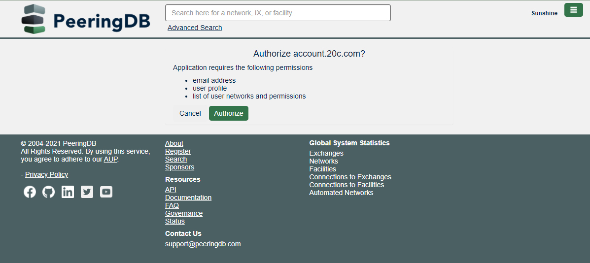

# Sign up for FullCtl

Go to: [account.fullctl.io](https://account.fullctl.io) and click on Register New Account.
   

To register, enter a user name, email, password, first name and last name. Indicate you are not a robot and click Sign Up.
   

You will be prompted to confirm your email address.
   

Support@fullctl.com will send you an email. Go to your email and click on the confirmation link provided to continue the registration process.

A confirmation message will appear on the website. 
   

Click on the Linked Authentication option on the right side of the screen. Under available providers, choose PeeringDB and click Add. Note: Please contact us for information on how to set up Okta backed authentication.
   

You will be directed to the PeeringDB website. Make sure you are logged into the site. Click on Authorize.
   

You will be redirected to the FullCtl website. When you click on Linked Authentication option on the right side of the screen you will see PeeringDB under Linked Providers.

   
