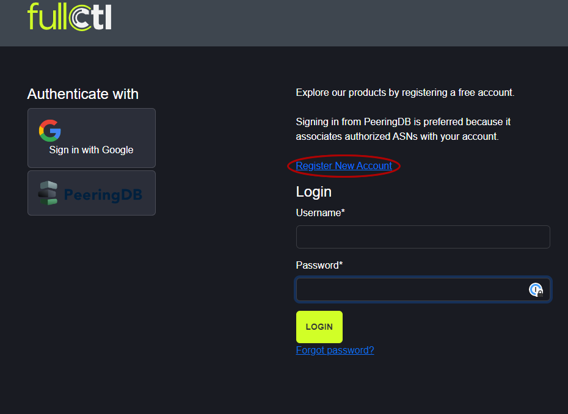
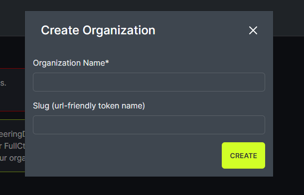
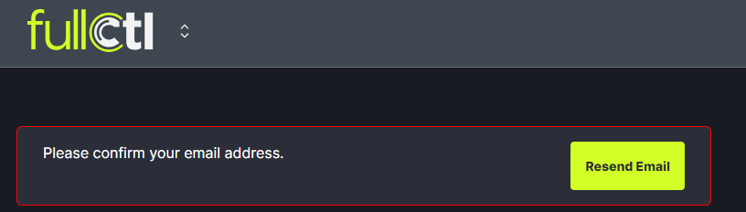

# Sign up for FullCtl

Go to: [account.fullctl.io](https://account.fullctl.io) and click on Register New Account.
   

To register, enter a username, email, password, first name and last name. Indicate you are not a robot and click Sign Up.
   

You will be prompted to Create an Organization. Enter the Organization name and slug. Click Create. This can serve as your personal Organization or can be your business/work-related Organization. You can be affiliated with multiple Organizations. If you want to be affiliated with an Organization that already exists on FullCtl, you must be invited by the Admin of that Organization. 
   

You will be prompted to confirm your email address.
   

Support@fullctl.com will send you an email. Go to your email and click on the confirmation link provided to continue the registration process.

A confirmation message will appear on the website. 
   
